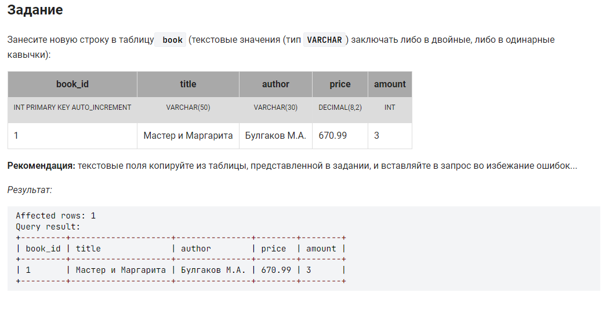

<div align="center">




```sql 
/*Заполнить таблицу с именем book (в скобках указаны имена столбоцов, вносимой информации)*/
INSERT INTO book (book_id, title, author, price, amount)

/* Указываем конкретные значения одной стоки, последовательность заполнения соотв. ранее указанным столбцам */
VALUES (1, 'Мастер и Маргарита', 'Булгаков М.А.', 670.99, 3);
```

---


