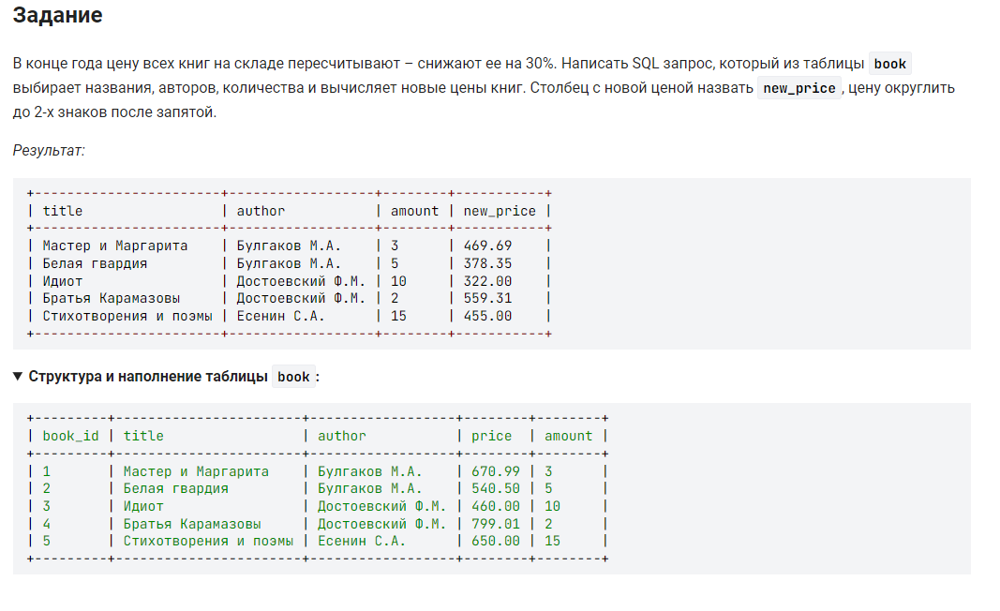

```sql
SELECT                                      /* вывести */
    title, author, amount,                  /* столбцы title, author, amount */
    ROUND(0.7 * price, 2) AS new_price      /* столбец price умноженный на 0.7 и округленный до 2-х знаков под псевдонином new_price */
FROM book;                                  /* таблицы book */
```


---


