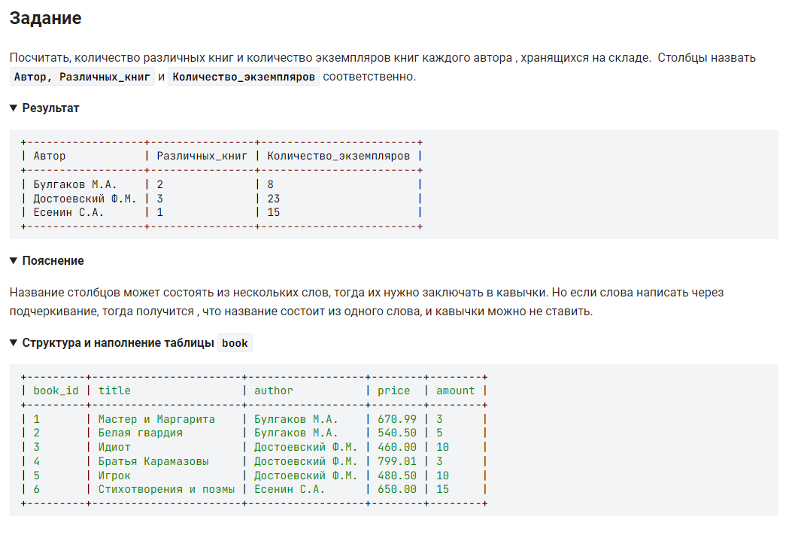

```sql
SELECT                                          /* вывести */
        author AS Автор,                        /* столбец  author подписанный как Автор*/
        COUNT(author) AS Различных_книг,        /* столбец  сколько записей относится к author подписанный как Различных_книг*/
        SUM(amount) AS Количество_экземпляров   /* столбец  сумма значений amount подписанный как Количество_экземпляров*/
        FROM book                               /* из таблицы book */
        GROUP BY author;                        /* сгруппированных в алфавитном порядке по столбцу author*/
```


---


