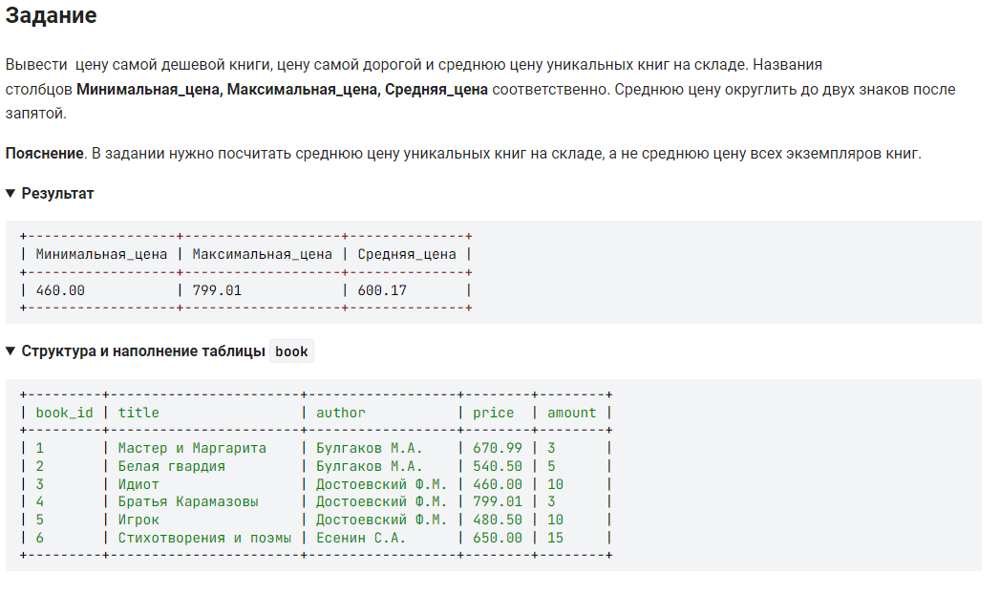

```sql
SELECT                                      /* вывести */
    MIN(price) AS Минимальная_цена,         /* столбец цена самой дешевой книги */
    MAX(price) AS Максимальная_цена,        /* столбец цена самой дорогой книги*/
    ROUND(AVG(price), 2) AS Средняя_цена    /* столбец  средняя цена книг */
        FROM book;                          /* из таблицы book */
```


---


