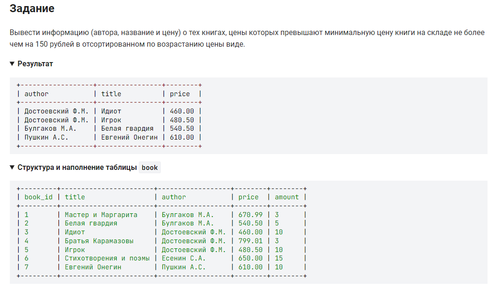

```sql
SELECT                                                      /* выбрать */
    author, title, price                                    /* столбцы */
    FROM book                                               /* из таблицы */
    WHERE (price - (SELECT MIN(price) FROM book)) <= 150    /* где цена превышают мини. цену книги на складе не более чем на 150 рублей */
    ORDER BY price;                                         /* отсортированном по возрастанию цены */
```

*** 2. вариант решения:

```sql
SELECT                                                      /* выбрать */
    author, title, price                                    /* столбцы */
    FROM book                                               /* из таблицы */
    WHERE price <= 150 + (SELECT MIN(price) FROM book)      /* где цена превышают мини. цену книги на складе не более чем на 150 рублей */
    ORDER BY price;                                         /* отсортированном по возрастанию цены */
```

#### На [главную](https://github.com/BEPb/stepik_sql#readme)

---


