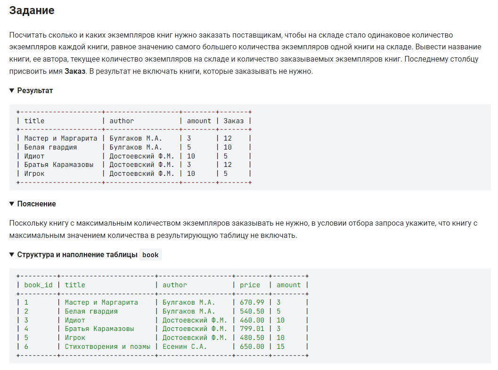

```sql
SELECT                                                  /* выбрать информацию */
    title, author, amount,                              /* столбцы */
    (SELECT MAX(amount) FROM book) - amount AS Заказ    /* столбец Заказ вычисляемый как разницы макс. значения от количества */
    FROM book                                           /* из таблицы */
    WHERE amount <> (SELECT MAX(amount) FROM book);     /* где количество не равно максимальному */
```

*** вариант 2:
```sql
SELECT                                                  /* выбрать информацию */
    title, author, amount,                              /* столбцы */
    (SELECT MAX(amount) FROM book) - amount AS Заказ    /* столбец Заказ вычисляемый как разницы макс. значения от количества */
    FROM book                                           /* из таблицы */
    HAVING Заказ > 0                                    /* Заказы больше нуля */
```


---


