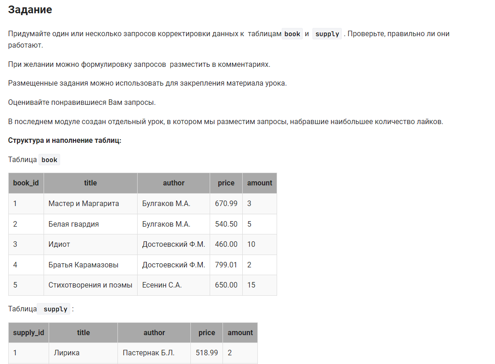

```sql
CREATE TABLE ordering                                   /*Создать таблицу заказ (ordering) */
    AS SELECT author, title,                            /* столбцы */
    (SELECT ROUND(AVG(amount)) FROM book) AS amount     /* столбец amount как среднее значение из таблицы book*/
        FROM book                                       /* из таблицы book */
        WHERE amount < (SELECT AVG(amount) FROM book);  /* где количество меньше среднего (убираем лишние строки) */
```


#### На [главную](https://github.com/BEPb/stepik_sql#readme)

---


