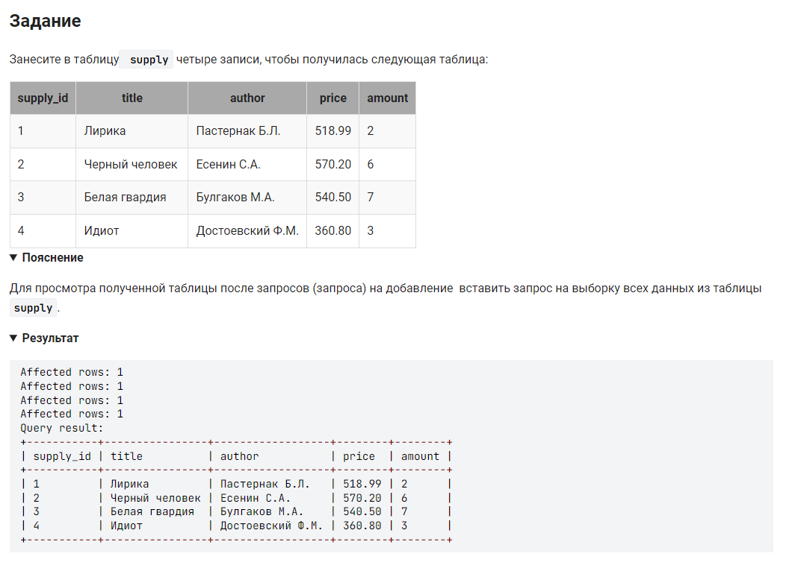

```sql
INSERT INTO supply (title, author, price, amount)   /* Занесите в таблицу supply (именя столбцов) */
VALUES                                              /* записи */
("Лирика", "Пастернак Б.Л.", 518.99, 2),            /* 1-я строка */
("Черный человек", "Есенин С.А.", 570.20, 6),       /* 2-я строка */
("Белая гвардия", "Булгаков М.А.", 540.50, 7),      /* 3-я строка */
("Идиот", "Достоевский Ф.М.", 360.80, 3);           /* 4-я строка */
```
*** вариант 2:

```sql
insert into supply(supply_id, title, author, price, amount) values (1, 'Лирика', 'Пастернак Б.Л.', 518.99, 2);
insert into supply(supply_id, title, author, price, amount) values (2, 'Черный человек', 'Есенин С.А.', 570.20, 6);
insert into supply(supply_id, title, author, price, amount) values (3, 'Белая гвардия', 'Булгаков М.А.', 540.50, 7);
insert into supply(supply_id, title, author, price, amount) values (4, 'Идиот', 'Достоевский Ф.М.', 360.80, 3);
```

На [главную](https://github.com/BEPb/stepik_sql/README.md)

---


