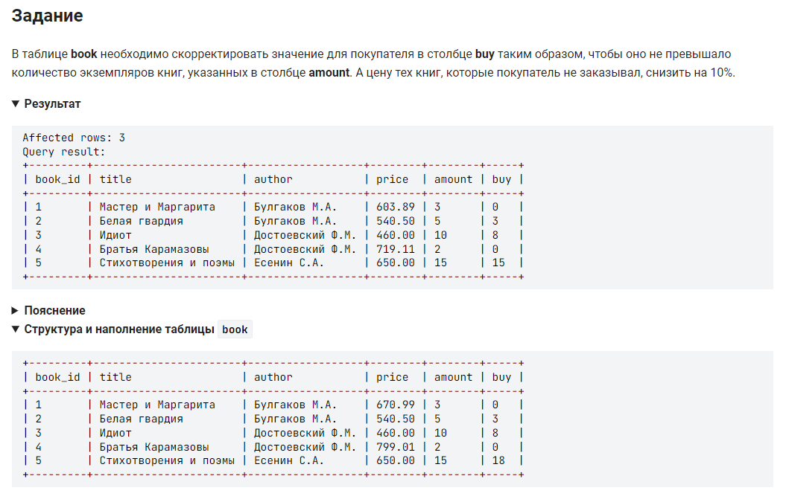

```sql
UPDATE book SET buy = IF(amount - buy < 0, amount, buy);    /* В таблице book изменить значение столбца buy */
UPDATE book SET price = price * 0.9 WHERE buy = 0;          /* В таблице book изменить значение столбца price */
```
*** варинт 2:
```sql
update book set buy = if(buy > amount, amount, buy),        /* В таблице book изменить значение столбца buy */
                price = if(buy = 0, price * 0.9, price);    /* изменить значение столбца price */
```

#### На [главную](https://github.com/BEPb/stepik_sql#readme)

---

