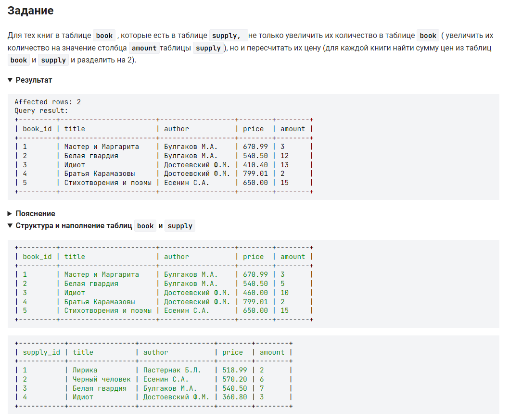

```sql
UPDATE book, supply                                                          /* обновить значения таблиц */
    SET book.amount = book.amount + supply.amount, book.price = (book.price + supply.price) / 2     /* столбцы */
    WHERE book.title = supply.title AND book.author = supply.author;        /* условия */
```

*** вариант 2:
```sql
update book, supply                                                         /* обновить значения таблиц */
    set book.amount=supply.amount+book.amount, book.price=(book.price+supply.price)/2   /* столбцы */
    where book.title=supply.title                                           /* условие */
```

#### На [главную](https://github.com/BEPb/stepik_sql#readme)

---


