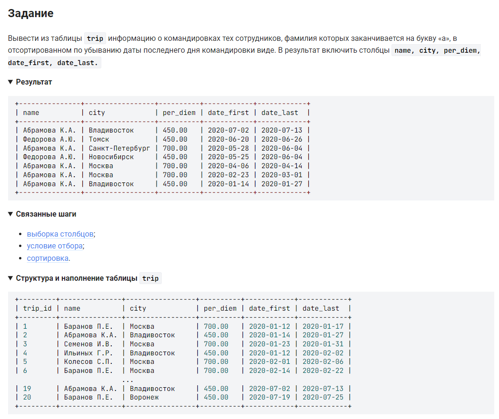

```sql
SELECT                                              /* выбрать данные */
    name, city, per_diem, date_first, date_last     /* столбцы */
    FROM trip                                       /* из таблицы */
    WHERE name LIKE "%а _._."                       /* где имя заканчивается на а */
    ORDER BY date_last DESC;                        /* отсортированном по убыванию даты последнего дня командировки */
```

#### На [главную](https://github.com/BEPb/stepik_sql#readme)

---


