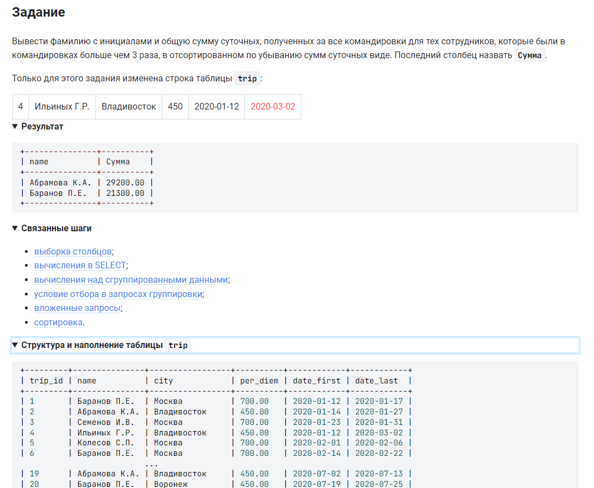

```sql
SELECT                                                                  /* вывести данные */
    name,                                                               /* столбец */
    SUM((DATEDIFF(date_last, date_first) + 1) * per_diem) AS Сумма      /* столбец сумма командировочных */
    FROM trip                                                           /* из таблицы */
    GROUP BY name                                                       /* сгруппированных по фамилии */
    HAVING COUNT(name) > 3                                              /* сотрудников бывших более чем в 3-х командировках */
    ORDER BY Сумма DESC;                                                /* отсортированном по убыванию сумм суточных виде*/
```

вариант 2:
```sql
SELECT                                                                  /* вывести данные */
    name,                                                               /* столбец */
    SUM((DATEDIFF(date_last, date_first) + 1) * per_diem) AS Сумма      /* столбец сумма командировочных */
    FROM trip                                                           /* из таблицы */
    GROUP BY name                                                       /* сгруппированных по фамилии */
    HAVING COUNT(*) > 3                                                 /* сотрудников бывших более чем в 3-х командировках */
    ORDER BY 2 DESC;                                                    /* отсортированном по 2-му столбцу */
```
#### На [главную](https://github.com/BEPb/stepik_sql#readme)

---


