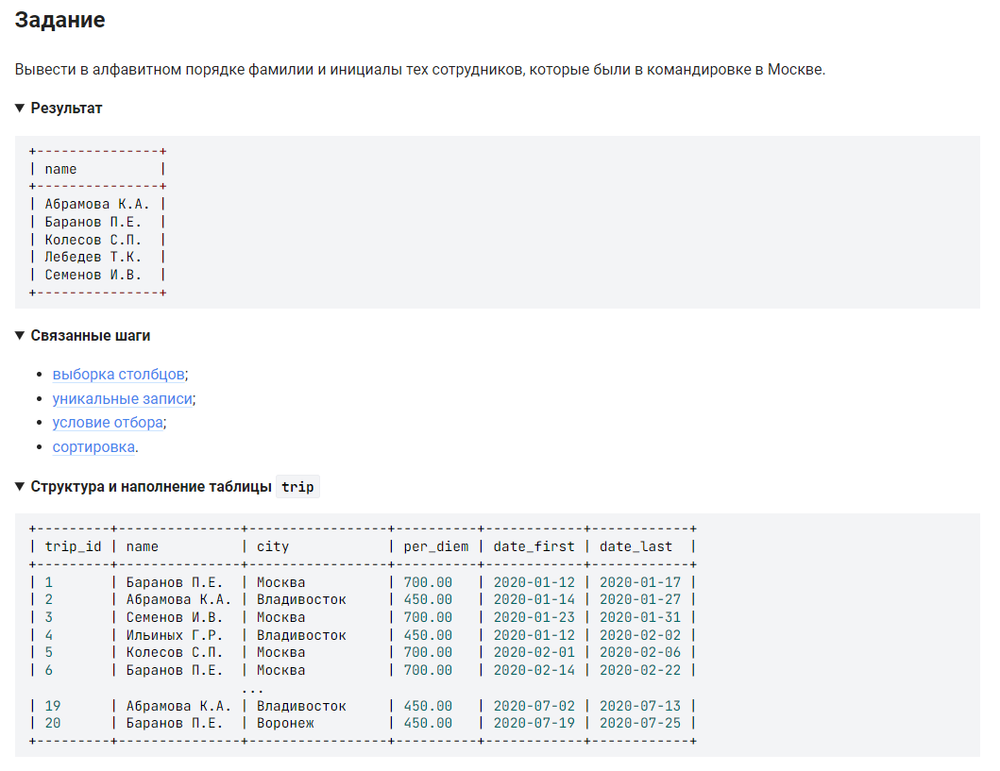

```sql
SELECT                      /* выбрать данные */
    DISTINCT name           /* уникальные записи столбца */
    FROM trip               /* из таблицы */
    WHERE city = "Москва"   /* где значение столбца city = "Москва" */
    GROUP BY name           /* сгруппированы по столбцу name */
    ORDER BY name;          /* расположены в алфавитном порядке столбца name */
```
вариант 2 (тоже верный):

```sql
SELECT                      /* выбрать данные */
    name                    /* столбец */
    FROM trip               /* из таблицы */
    WHERE city = "Москва"   /* где значение столбца city = "Москва" */
    GROUP BY name           /* сгруппированы по столбцу name */
    ORDER BY name;          /* расположены в алфавитном порядке столбца name */

```

#### На [главную](https://github.com/BEPb/stepik_sql#readme)

---


