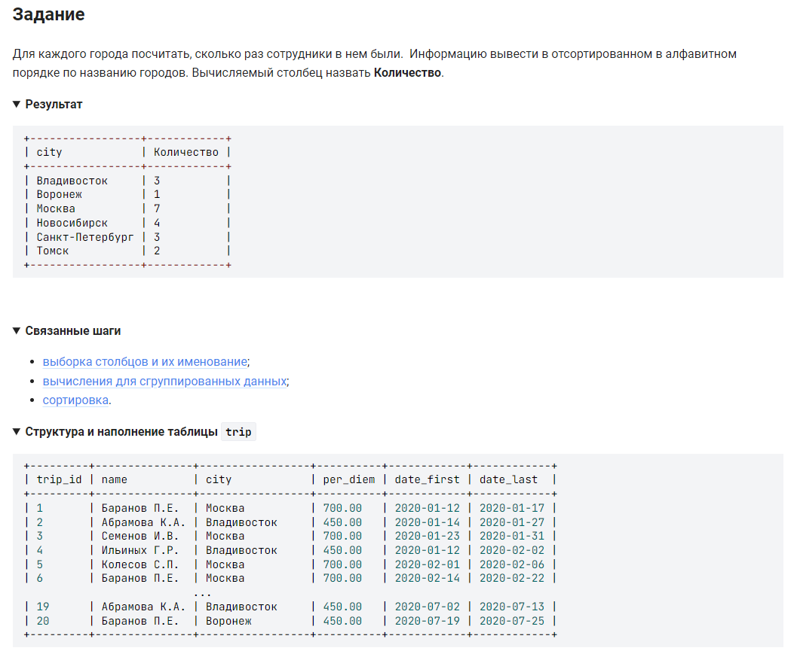

```sql
SELECT                          /* выбрать данные  */
    city,                       /* столбца */
    COUNT(city) AS Количество   /* столбец вычисления количества */
    FROM trip                   /* из таблицы  */
    GROUP BY city               /* сгруппировать по столбцу  */
    ORDER BY city;              /* отсортировать в алфавитном порядке */
```
вариант 2:
```sql
SELECT                          /* выбрать данные  */
    city,                       /* столбца */
    COUNT(*) AS Количество      /* столбец вычисления количества */
    FROM trip                   /* из таблицы  */
    GROUP BY city               /* сгруппировать по столбцу  */
    ORDER BY city;              /* отсортировать в алфавитном порядке */
```

#### На [главную](https://github.com/BEPb/stepik_sql#readme)

---


