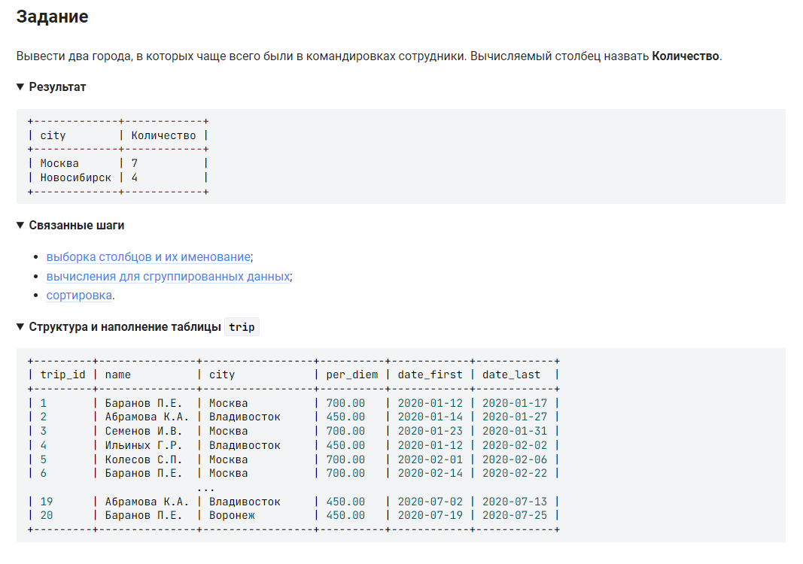

```sql
SELECT                          /* выбрать данные */
    city,                       /* столбец */
    COUNT(city) AS Количество   /* вычислить количество значений столбца */
    FROM trip                   /* из таблицы */
    GROUP BY city               /* сгруппировать по столбцу */
    ORDER BY COUNT(city) DESC   /* расположить в порядке убывания количества */
    LIMIT 2;                    /* не более 2-х строк */
```

#### На [главную](https://github.com/BEPb/stepik_sql#readme)

---


