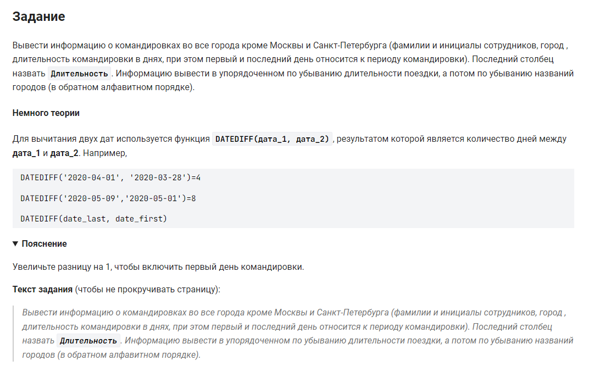

```sql
SELECT                                                      /* выбрать данные */
    name, city,                                             /* столбцы */
    (DATEDIFF(date_last, date_first) + 1) AS Длительность   /* вычислить разницу между датами командировки */
    FROM trip                                               /* из таблицы */
    WHERE city  NOT IN ("Москва", "Санкт-Петербург")        /* где город не "Москва", и не "Санкт-Петербург"*/
    ORDER BY Длительность DESC,                             /* упорядочить по убыванию длительности поездки */
    city DESC;                                              /* потом по названию городов (в обр. алфавитном порядке) */
```

#### На [главную](https://github.com/BEPb/stepik_sql#readme)

---


