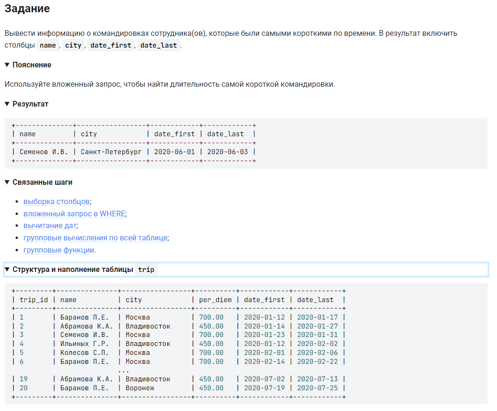

```sql
SELECT                                                              /* выбрать данные */
    name, city, date_first, date_last                               /* столбцы */
    FROM trip                                                       /* из таблицы */
    WHERE DATEDIFF(date_last, date_first) =                         /* где разница дат равна */
        (SELECT MIN(DATEDIFF(date_last, date_first)) FROM trip);    /* минимальному сроку командировки */
```

#### На [главную](https://github.com/BEPb/stepik_sql#readme)

---


