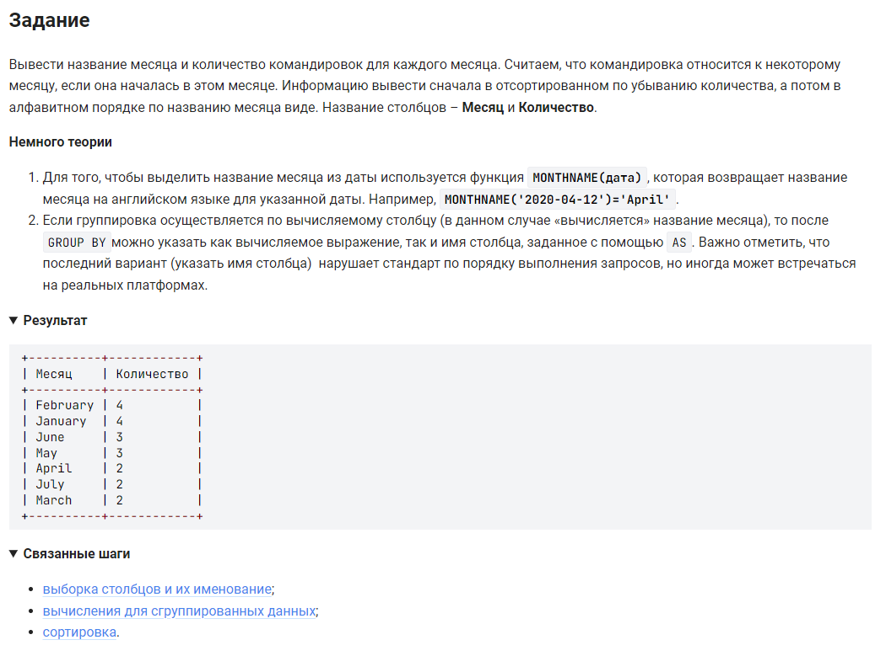

```sql
SELECT                                      /* выбрать данные */
    MONTHNAME(date_first) AS Месяц,         /* столбец начала командировки под названием Месяц */
    COUNT(MONTH(date_first)) AS Количество  /* вычислить количество командировок которые начались в каждом месяце */
    FROM trip                               /* из таблицы */
    GROUP BY Месяц                          /* сгруппировать по столбцу Месяц */
    ORDER BY Количество DESC, Месяц;        /* отсортированном по убыванию количества, потом по месяцам */
```

#### На [главную](https://github.com/BEPb/stepik_sql#readme)

---


