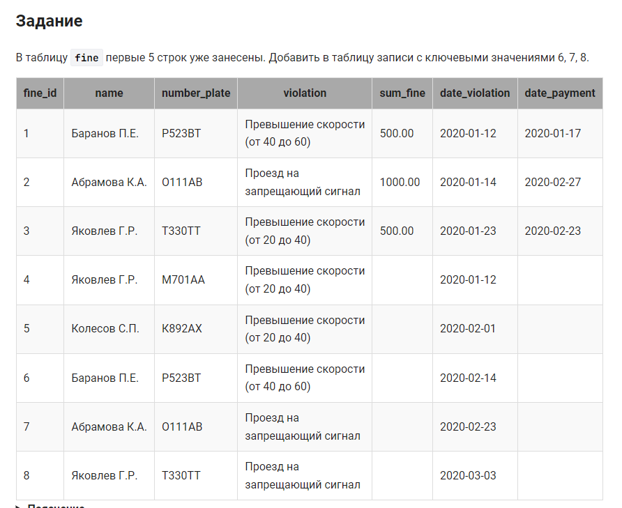

```sql
/*Добавить в таблицу записи*/
INSERT INTO fine (name, number_plate, violation, sum_fine, date_violation, date_payment)
VALUES ('Баранов П.Е.', 'Р523ВТ', 'Превышение скорости(от 40 до 60)', NULL, '2020-02-14 ', NULL),
       ('Абрамова К.А.', 'О111АВ', 'Проезд на запрещающий сигнал', NULL, '2020-02-23', NULL),
       ('Яковлев Г.Р.', 'Т330ТТ', 'Проезд на запрещающий сигнал', NULL, '2020-03-03', NULL);
```

вариант 2:
```sql
insert into fine(fine_id, name, number_plate, violation, sum_fine, date_violation, date_payment) 
           values(6, "Баранов П.Е.", 'Р523ВТ', 'Превышение скорости(от 40 до 60)', Null, '2020-02-14', Null);
insert into fine(fine_id, name, number_plate, violation, sum_fine, date_violation, date_payment) 
           values(7, "Абрамова К.А.", 'О111АВ', 'Проезд на запрещающий сигнал', Null, '2020-02-23', Null);
insert into fine(fine_id, name, number_plate, violation, sum_fine, date_violation, date_payment) 
           values(8, "Яковлев Г.Р.", 'Т330ТТ', 'Проезд на запрещающий сигнал', Null, '2020-03-03', Null);
```
#### На [главную](https://github.com/BEPb/stepik_sql#readme)

---


