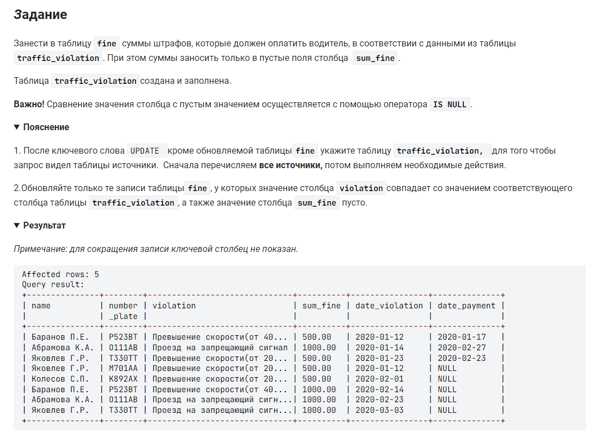

```sql
UPDATE fine AS f, traffic_violation AS tv                   /* обновляем таблицу fine, используя как источник таблицу traffic_violation */
SET f.sum_fine = tv.sum_fine                                /* обновляем поле sum_fine в таблице fine данными из такого же поля таблицы tv */
WHERE tv.violation = f.violation and f.sum_fine IS Null;    /* где значения уже заполнены скопировать их */
                                                            /* если не указать where то код заменит все значения во всей таблице и тогда у первого ФИО поменяется штраф)*/
                                               
```

вариант который даказывает, что перед псевдонином табилицы AS указывать не обязательно: 
```sql
UPDATE fine f, traffic_violation tv                         /* обновляем таблицу fine, используя как источник таблицу traffic_violation */
SET f.sum_fine = tv.sum_fine                                /* обновляем поле sum_fine в таблице fine данными из такого же поля таблицы tv */
WHERE tv.violation = f.violation and f.sum_fine IS Null;    /* где значения уже заполнены скопировать их */
                                                            /* если не указать where то код заменит все значения во всей таблице и тогда у первого ФИО поменяется штраф)*/                                               
```
тоже верный, но более медленный запрос:
```sql

UPDATE fine AS f, traffic_violation AS tv                           /* обновляем таблицу fine, используя как источник таблицу traffic_violation */
SET f.sum_fine = IF(f.sum_fine IS Null, tv.sum_fine, f.sum_fine)    /* обновляем поле sum_fine в таблице fine данными из такого же поля таблицы tv удовлетворяющего условию*/
WHERE tv.violation = f.violation;                                   /* где значения уже заполнены скопировать их */
```
#### На [главную](https://github.com/BEPb/stepik_sql#readme)

---


