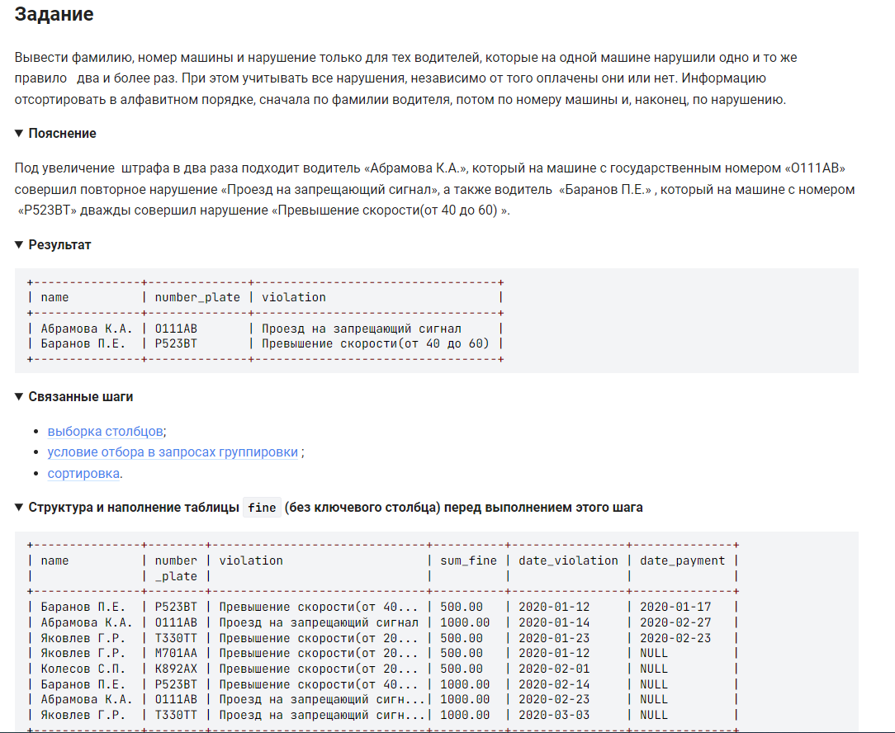

```sql
SELECT name, number_plate, violation        /* вывести столбцы */
    FROM fine                               /* таблицы */
    GROUP BY name, number_plate, violation  /* сгруппированные по */
    HAVING COUNT(violation) >= 2            /* имеющих повторения более или равных 2 */
    ORDER BY name, number_plate, violation  /* отосритировать сначала по фамилии, потом по номеру машины и, наконец, по нарушению */
```
тоже самое можно представить:
```sql
SELECT name, number_plate, violation        /* вывести столбцы */
    FROM fine                               /* таблицы */
    GROUP BY 1, 2, 3                        /* сгруппированные по */
    HAVING COUNT(*) >1                      /* имеющих повторения более 1-го раза */
    ORDER BY 1, 2, 3                        /* отосритировать сначала по фамилии, потом по номеру машины и, наконец, по нарушению */
```

#### На [главную](https://github.com/BEPb/stepik_sql#readme)

---


