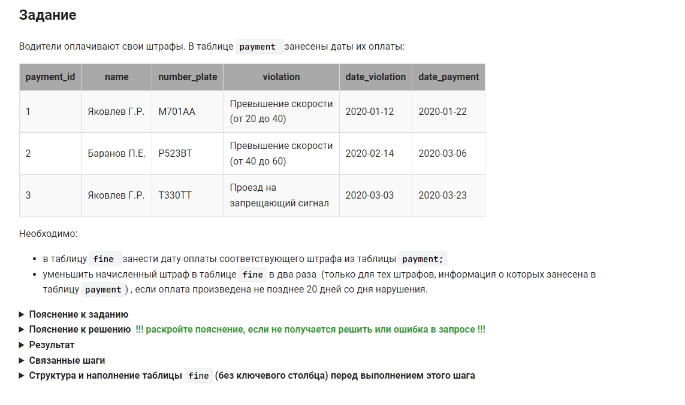

```sql
UPDATE fine f, payment p                        /* обновить значение таблицы fine из таблицы payment */
SET    f.date_payment = p.date_payment,         /* занести дату оплаты соответствующего штрафа из таблицы payment */
       f.sum_fine = IF(DATEDIFF(p.date_payment, f.date_violation) <= 20, f.sum_fine / 2, f.sum_fine)                        /* уменьшить начисленный штраф в таблице fine в два раза, только для новых штрафов */
WHERE f.name = p.name                           /* где данные из двух таблиц соответствуют одному штрафу */
        AND f.number_plate = p.number_plate
        AND f.violation = p.violation
        AND f.date_violation = p.date_violation;
```
более изящный вариант записи этого же запроса:

```sql
UPDATE fine f, payment p                        /* обновить значение таблицы fine из таблицы payment */
SET    f.date_payment = p.date_payment,         /* занести дату оплаты соответствующего штрафа из таблицы payment */
       f.sum_fine = IF(DATEDIFF(p.date_payment, f.date_violation) <= 20, f.sum_fine / 2, f.sum_fine)                        /* уменьшить начисленный штраф в таблице fine в два раза, только для новых штрафов */
WHERE (f.name, f.number_plate, f.violation, f.date_violation) = (p.name, p.number_plate, p.violation, p.date_violation);    /* где данные из двух таблиц соответствуют одному штрафу */
```

#### На [главную](https://github.com/BEPb/stepik_sql#readme)

---


