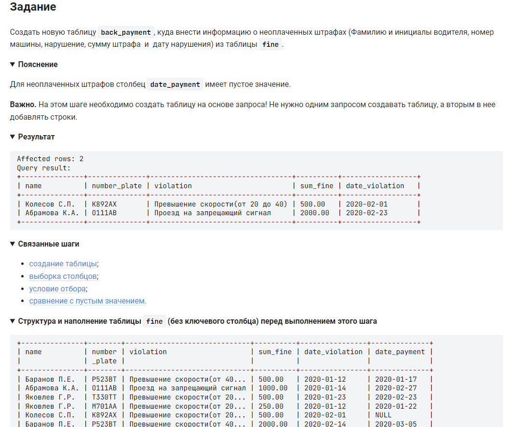

```sql
CREATE TABLE back_payment AS                                        /* Создать новую таблицу back_payment как ...*/
SELECT name, number_plate, violation, sum_fine, date_violation      /* выбрать столбцы */
FROM fine                                                           /* из таблицы */
WHERE date_payment IS NULL;                                         /* где даты оплаты не указана */
```
вариант решения в две команды:
```sql
CREATE TABLE back_payment               /* Создать новую таблицу back_payment как ...*/
(SELECT * FROM fine                     /* выбрать все столбцы из таблицы */
    WHERE ISNULL(date_payment));        /* где даты оплаты не указана */

ALTER TABLE back_payment                /* команда alter (латинское alter = другой) "переделывает" таблицу в другой вариант */
    DROP fine_id, DROP date_payment;    /* удалим лишние столбцы */
```
#### На [главную](https://github.com/BEPb/stepik_sql#readme)

---


