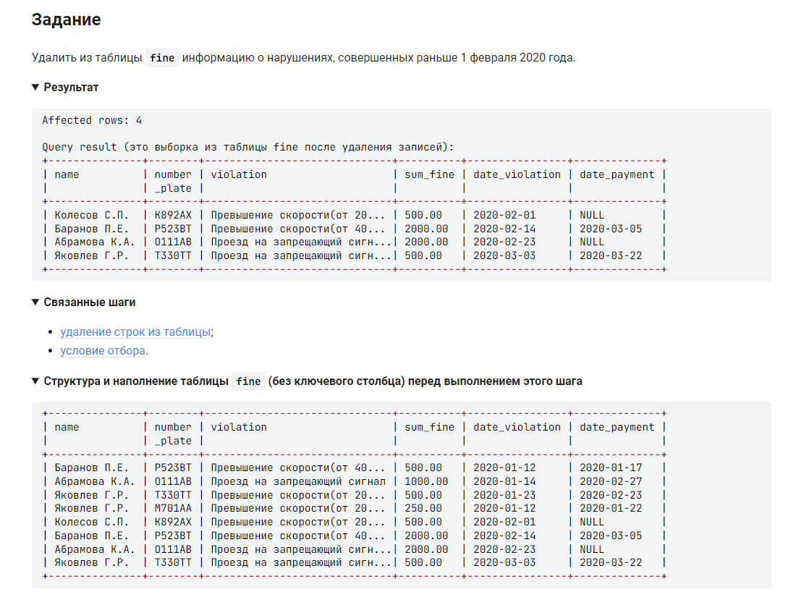

```sql
DELETE FROM fine                            /*Удалить из таблицы fine */
    WHERE date_violation < "2020-02-01";    /*где информация о нарушениях, совершенных раньше 1 февраля 2020 года. */
```
дату можно указать и без кавычек:

```sql
DELETE FROM fine                            /*Удалить из таблицы fine */
    WHERE date_violation < 20200201;        /*где информация о нарушениях, совершенных раньше 1 февраля 2020 года. */
```

так же задачу можно решить используя вычисления разницы дат DATEDIFF, вариант сложнее, но паказывает как он работает:
```sql
DELETE FROM fine                                                /*Удалить из таблицы fine */
    WHERE DATEDIFF(date_violation, DATE('2020-02-01')) < 0;     /*где информация о нарушениях, совершенных раньше 1 февраля 2020 года. */
```

#### На [главную](https://github.com/BEPb/stepik_sql#readme)

---


