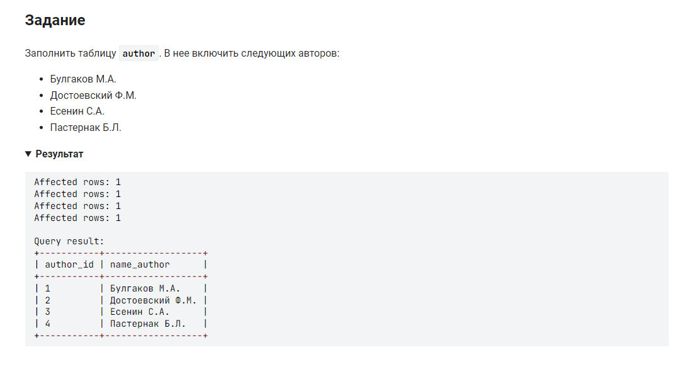

```sql 
INSERT INTO author (name_author)    /* Заполнить таблицу author столбец name_author */
VALUES                              /* значения столбца: */
    ('Булгаков М.А.'),
    ('Достоевский Ф.М.'),
    ('Есенин С.А.'),
    ('Пастернак Б.Л.');
```
#### На [главную](https://github.com/BEPb/stepik_sql#readme)

---


