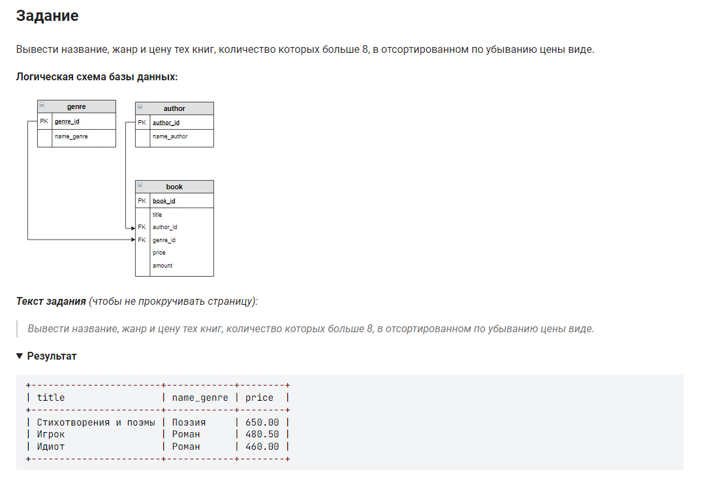

```sql 
SELECT title, name_genre, price         /* Вывести столбцы .*/
FROM genre INNER JOIN book              /* из таблицы соединенной с таблицей .*/
     ON genre.genre_id = book.genre_id  /* при условии .*/
WHERE amount > 8                        /* где количество больше 8 .*/
ORDER BY price DESC;                    /* отсортировать по цене в обратном порядке .*/
```

реализуя INNER JOIN можно опустить INNER, т.к он используется по дефолту.

Так же, если мы имеем таблицы где PR и FK(в другой таблице) имеют одно название, для соединения можно заменить ON book.genre_id = genre.genre_id на USING(genre_id) - записи эквивалентны

```sql 
SELECT title, name_genre, price         /* Вывести столбцы .*/
JOIN genre USING(genre_id)              /* из таблицы соединенной с таблицей .*/
WHERE amount > 8                        /* где количество больше 8 .*/
ORDER BY price DESC;                    /* отсортировать по цене в обратном порядке .*/
```
или такая форма записи
```sql
SELECT title, name_genre, price
FROM genre g JOIN book b
ON g.genre_id = b.genre_id AND b.amount > 8
ORDER BY price DESC
```

#### На [главную](https://github.com/BEPb/stepik_sql#readme)

---


