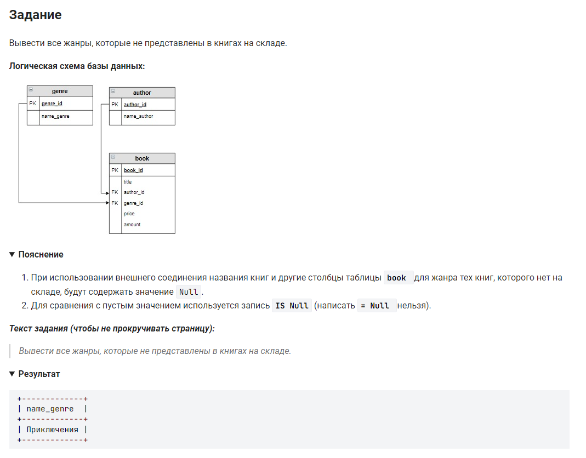

```sql 
SELECT name_genre                       /* вывести данные столбца жанры */
FROM genre                              /* из таблицы */
	LEFT JOIN book                      /* соединенного с таблицей */
	ON genre.genre_id = book.genre_id   /* при условии */
    WHERE title IS NULL;                /* где названия книг отсутвуют */
```
вариант:
```sql
SELECT name_genre                       /* вывести данные столбца жанры */
FROM genre                              /* из таблицы */
    LEFT JOIN book USING(genre_id)      /* соединенного с таблицей */
    WHERE title IS NULL;                /* где названия книг отсутвуют */
```

или еще вариант:
```sql
SELECT name_genre                       /* вывести данные столбца жанры */
FROM genre                              /* из таблицы */
    LEFT JOIN book USING(genre_id)      /* соединенного с таблицей */
WHERE amount IS NULL;                   /* где названия количество отсутвует */
```
#### На [главную](https://github.com/BEPb/stepik_sql#readme)

---


