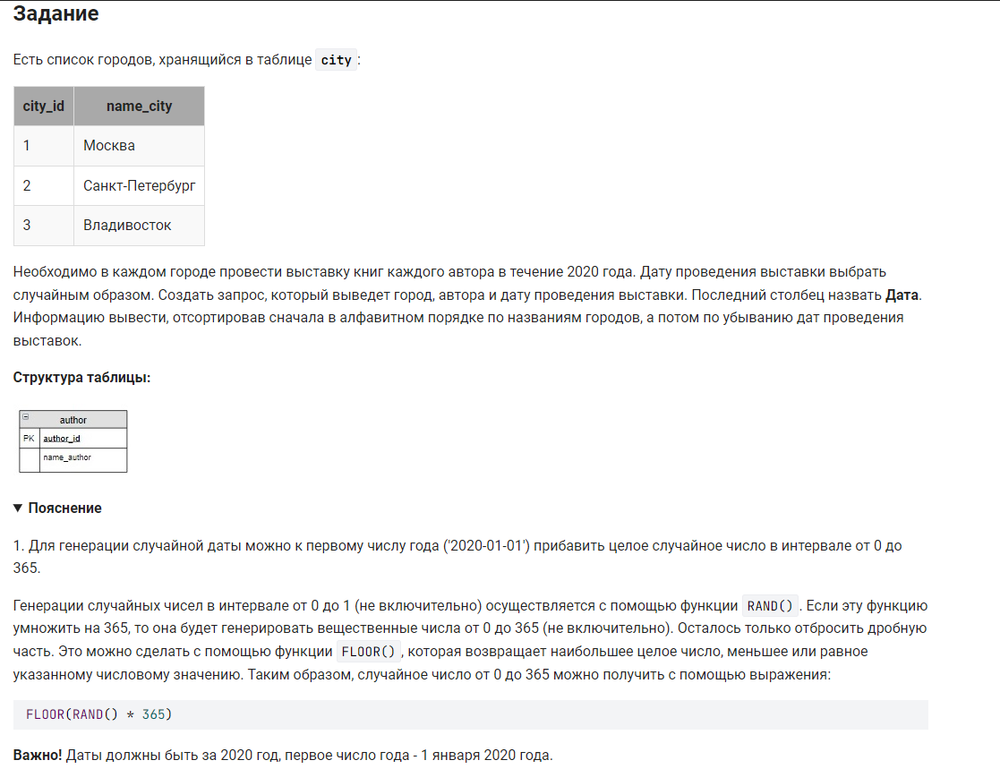

```sql 
SELECT                              /* выбрать данные */
    city.name_city,                 /* столбец */
    author.name_author,             /* столбец */
    DATE_ADD('2020-01-01',INTERVAL FLOOR(RAND() * 365) DAY) AS Дата /* столбец дата случайная в течении года */
FROM                                /* из */
    author CROSS JOIN city          /* соединенных таблиц */
ORDER BY                            /* отсортированных */
    city.name_city,                 /* по названию города */
    Дата DESC;                      /* а затем по дате по убыванию */
```
более короткая запиь:

```sql 
SELECT 
       name_city, 
       name_author, 
       DATE_ADD('2020-01-01', INTERVAL FLOOR(RAND(42) * 365) DAY) as Дата 
FROM 
       author, city
ORDER BY 
       name_city, 
       Дата DESC;
```
или еще короче (использую нумерацию столбцов):

```sql 
SELECT name_city,
       name_author,
       DATE_ADD( '2020-01-01' , INTERVAL FLOOR(RAND() * 365) DAY) AS Дата
  FROM city
       CROSS JOIN author
 ORDER BY 1, 3 DESC;
```

#### На [главную](https://github.com/BEPb/stepik_sql#readme)

---


