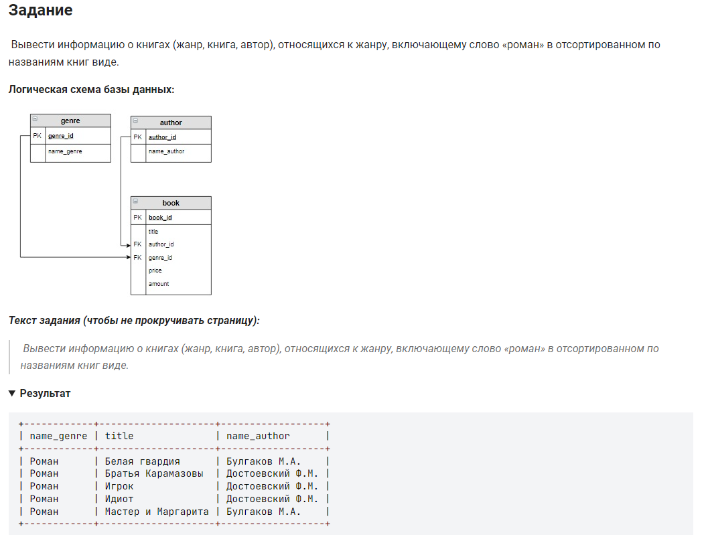

```sql 
SELECT                                                      /*Вывести информацию*/
    name_genre, title, name_author                          /*столбцы */
FROM genre                                                  /*из таблицы */
	INNER JOIN book ON genre.genre_id = book.genre_id       /*соединенной с таблицей */
    INNER JOIN author ON author.author_id = book.author_id  /*соединенной с таблицей */
WHERE name_genre LIKE "%роман%"                             /* где имя содержит слово роман*/
ORDER BY title;                                             /* отсортировать по названию */
```
#### На [главную](https://github.com/BEPb/stepik_sql#readme)

---


