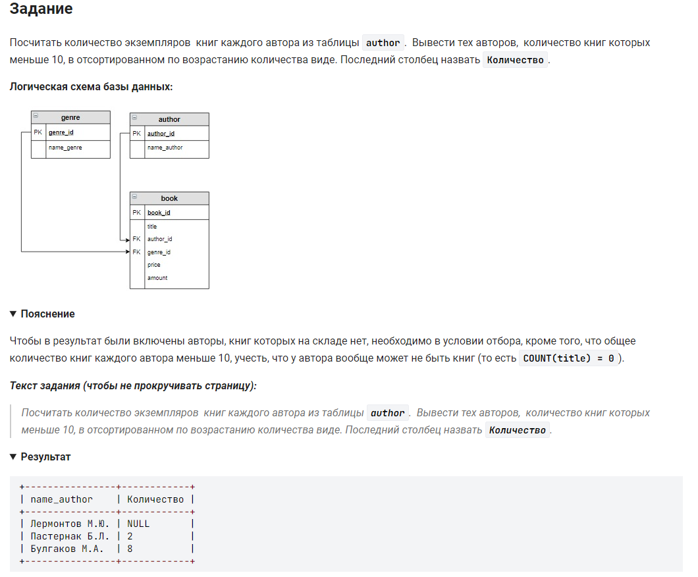

```sql 
SELECT                          /* выбрать данные */
    name_author,                /* столбец */
    SUM(amount) AS Количество   /* столбец сумма количества */
FROM                            /* из*/
    author                      /* таблицы */
    LEFT JOIN book              /* соединенной */
    ON author.author_id = book.author_id     /* при условии */
GROUP BY                        /* сгруппированной */
    name_author                 /* по авторам */
HAVING                          /* имеющих */
    Количество < 10             /* условие 1 */
    OR Количество is NULL       /* или условие 2 */
ORDER BY                        /* отсортированном */
    Количество;                 /* по количеству */
```
#### На [главную](https://github.com/BEPb/stepik_sql#readme)

---


