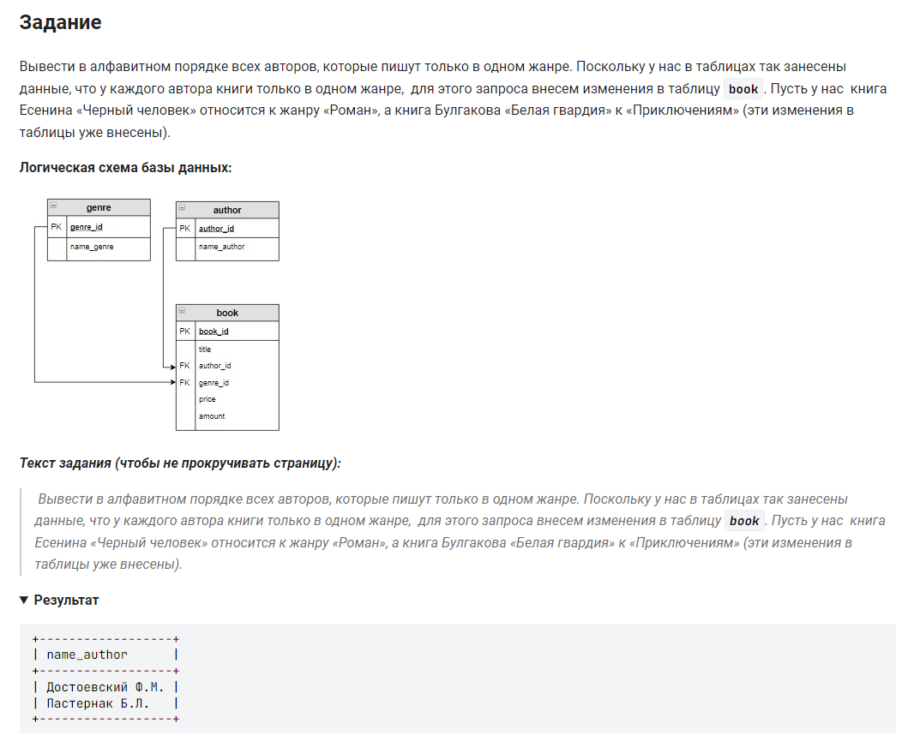

```sql
SELECT name_author                          /* выбрать данные столбца */
FROM author                                 /* из таблицы */
  LEFT JOIN book                            /* соединенной с таблицей */
  ON author.author_id = book.author_id      /* при условии */
GROUP BY author.author_id                   /* сгруппировать по авторам */
HAVING COUNT(DISTINCT genre_id) = 1         /* при условии */
ORDER BY name_author;                       /* отсортировать по имени */
```
вариант 2:
```sql
SELECT name_author                          /* выбрать данные столбца */
FROM author                                 /* из таблицы */
  LEFT JOIN book                            /* соединенной с таблицей */
  ON author.author_id = book.author_id      /* при условии */
GROUP BY author.author_id                   /* сгруппировать по авторам */
HAVING MIN(genre_id) = MAX(genre_id)        /* при условии */
ORDER BY name_author;                       /* отсортировать по имени */
```
вариант 3:
```sql
SELECT name_author                          /* выбрать данные столбца */ 
FROM                                        /* из предварительно подготовленных данных */
	(SELECT name_author, name_genre                                     /* выбрать столбцы */
    FROM genre                                                          /* из таблицы */
		INNER JOIN book ON genre.genre_id = book.genre_id               /* связанная с таблицей */
        INNER JOIN author ON author.author_id = book.author_id) buff    /* связанная с таблицей */
GROUP BY name_author                        /* сгруппированных по имени автора */
HAVING COUNT(DISTINCT name_genre) = 1       /* где количество повторений жанра = 1 */
ORDER BY name_author;                       /* отсортировать по имени автора */
```
#### На [главную](https://github.com/BEPb/stepik_sql#readme)

---


