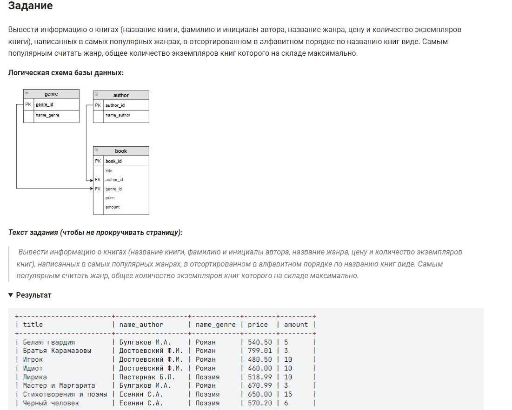

```sql 
SELECT                                                      /* выбрать данные */
    title, name_author, name_genre, price, amount           /* столбцы */
FROM author                                                 /* из таблицы */
	INNER JOIN book ON author.author_id = book.author_id    /* соединить с таблицей */
    INNER JOIN genre ON genre.genre_id = book.genre_id      /* соединить с таблицей */
WHERE book.genre_id IN (                                    /* где жанр книги */
    SELECT genre_id                                         /* выбрать данные */
    FROM book                                               /* из таблицы */
    GROUP BY genre_id                                       /* сгруппировать по */
    HAVING SUM(amount) =                                    /* имеющий сумму количества равную */
        (SELECT MAX(sums) AS max_sum                        /* выбрать данные */
        FROM                                                /* из */
        (SELECT SUM(amount) AS sums                         /* выбрать сумму количества */
        FROM book                                           /* из таблицы */
        GROUP BY genre_id) buff))                           /* сгруппировать */
ORDER BY title;                                             /* отсортировать по названию */
```
#### На [главную](https://github.com/BEPb/stepik_sql#readme)

---


