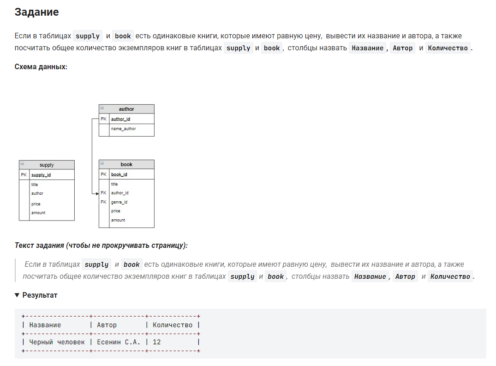

```sql
SELECT                                                              /* выбрать данные */
    title as Название,                                              /* столбец */
    author as Автор,                                                /* столбец */
    s.amount + b.amount as Количество                               /* столбец */
 FROM                                                               /* из */
    supply s JOIN book b USING (price, title)                       /* таблицы соединенной с таблицей */
```

так же верно, но подробно:
```sql 
SELECT                                                              /* выбрать данные */
    book.title AS Название,                                         /* столбец */
    name_author AS Автор,                                           /* столбец*/
    book.amount + supply.amount AS Количество                       /* столбец */
FROM                                                                /* из */
    book                                                            /* таблицы */
    INNER JOIN author ON book.author_id = author.author_id          /* соединенной с таблицей*/
    INNER JOIN supply ON book.title = supply.title                  /* соединенной с таблицей*/
                         and author.name_author = supply.author     /* условие */
                         and book.price = supply.price;             /* условие */
```

#### На [главную](https://github.com/BEPb/stepik_sql#readme)

---


