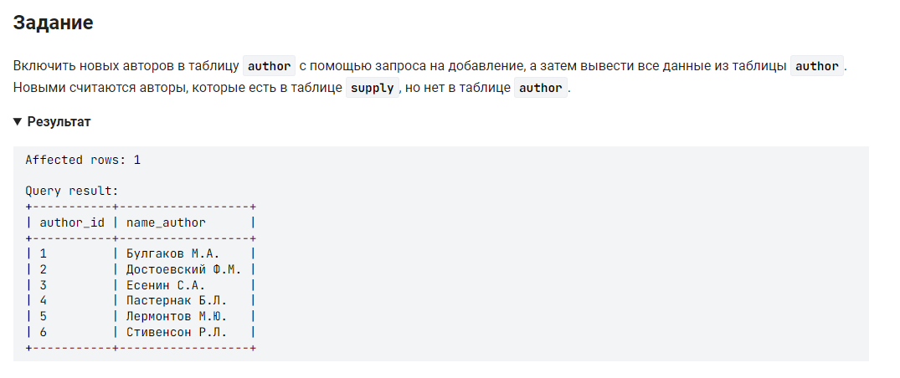

```sql 
INSERT INTO author (name_author)                                    /* вставить в таблицу (столбец) */
	(SELECT supply.author                                           /* выбрать данные столбца author из таблицы supply */
    FROM author                                                     /* из таблицы author */
		RIGHT JOIN supply ON supply.author = author.name_author     /* объединенной с таблицей supply где имена авторов одинаковы */
	WHERE author.name_author IS NULL);                              /* где имя автора в таблице author не указано */
```

```sql
INSERT INTO author (name_author)                                    /* вставить в таблицу (столбец) */
SELECT author                                                       /* выбрать данные столбца author  */
FROM supply                                                         /* из таблицы supply */
WHERE author NOT IN (SELECT name_author FROM author)                /* где имя автора не содержится в столбце name_author таблицы author */
```


#### На [главную](https://github.com/BEPb/stepik_sql#readme)

---


