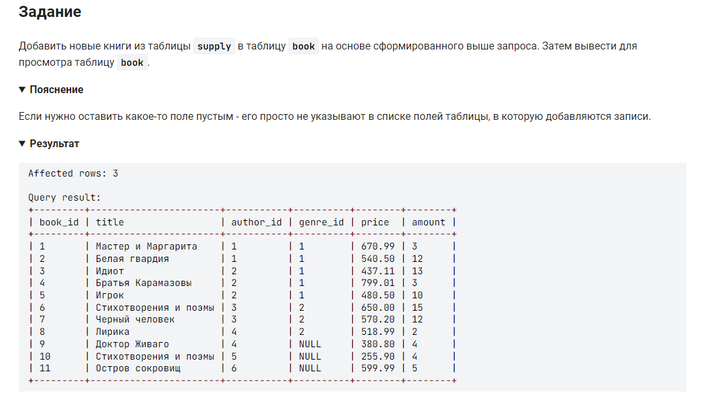

```sql 
INSERT INTO book                                                /* вставить в таблицу (столбцы)*/
SELECT                                                          /* выбрать данные */
    NULL AS book_id,                                            /* столбец не заполняем т.к. данные присваиваются автоматически */
    title,                                                      /* столбец */
    author_id,                                                  /* столбец */
    NULL AS genre_id,                                           /* столбец не заполняем т.к. нет такого требования по условию задачи */
    price,                                                      /* столбец */
    amount                                                      /* столбец */
FROM                                                            /* из */
    author                                                      /* таблицы */
    INNER JOIN supply ON author.name_author = supply.author     /* внутреннее объединение с таблицей где имена авторов равные*/
	WHERE amount <> 0;                                          /* и где количество не равно нулю */
```
нет необходимости указывать при заполнении столбец автоматической нумерации строк: 
```sql
INSERT INTO book (genre_id, title, author_id, price, amount)    /* вставить в таблицу (столбцы)*/
	(SELECT NULL, title, author_id, price, amount               /* выбрать данные столбцов */
    FROM author                                                 /* из таблицы */
		INNER JOIN supply ON author.name_author = supply.author /* внутреннее объединение с таблицей где имена авторов равные*/
	WHERE amount <> 0);                                         /* и где количество не равно нулю */
```
точно так же нет необходимости указывать столбец жанра:
```sql
INSERT INTO book (title, author_id, price, amount)              /* вставить в таблицу (столбцы)*/
	(SELECT title, author_id, price, amount                     /* выбрать данные столбцов */
    FROM author                                                 /* из таблицы */
		INNER JOIN supply ON author.name_author = supply.author /* внутреннее объединение с таблицей где имена авторов равные*/
	WHERE amount <> 0);                                         /* и где количество не равно нулю */
```


#### На [главную](https://github.com/BEPb/stepik_sql#readme)

---


