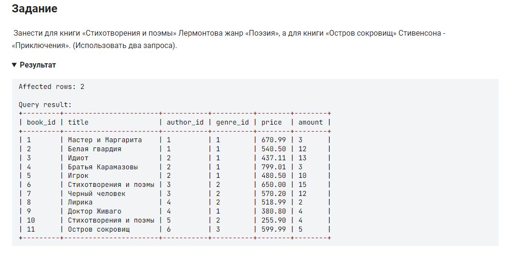

```sql 

UPDATE book                                                 /* обновить таблицу */
INNER JOIN author                                           /* объединенной с таблицей */
ON book.author_id = author.author_id                        /* где номер автора одинаков */
SET genre_id =                                              /* столбец жанр */
	(SELECT genre_id                                        /* выбрать данные столбца */
    FROM genre                                              /* из таблицы */
    WHERE name_genre = "Поэзия")                            /* где жанр =, это же значение и внести в таблицу */
WHERE                                                       /* где */
    title = "Стихотворения и поэмы" AND                     /* название произведения = */
    name_author LIKE "%Лермонтов%";                         /* имя автора = */

UPDATE book                                                 /* обновить таблицу */
INNER JOIN author                                           /* объединенной с таблицей */
ON book.author_id = author.author_id                        /* где номер автора одинаков */
SET genre_id =                                              /* столбец жанр */
	(SELECT genre_id                                        /* выбрать данные столбца */
    FROM genre                                              /* из таблицы */
    WHERE name_genre = "Приключения")                       /* где жанр =, это же значение и внести в таблицу */
WHERE                                                       /* где */
    title = "Остров сокровищ" AND                           /* название произведения = */
    name_author LIKE "%Стивенсон%";                         /* имя автора = */
```

упростим выражение, выкинув лишнее:
```sql
UPDATE book                                                 /* обновить таблицу */
SET genre_id =                                              /* столбец жанр */
	(SELECT genre_id                                        /* выбрать данные столбца */
    FROM genre                                              /* из таблицы */
    WHERE name_genre = "Поэзия")                            /* где жанр =, это же значение и внести в таблицу */
WHERE title = "Стихотворения и поэмы" AND author_id = 5;    /* где условие 1 и 2 */

UPDATE book                                                 /* обновить таблицу */
SET genre_id =                                              /* столбец жанр */
	(SELECT genre_id                                        /* выбрать данные столбца */
    FROM genre                                              /* из таблицы */
    WHERE name_genre = "Приключения")                       /* где жанр =, это же значение и внести в таблицу */
WHERE title = "Остров сокровищ" AND author_id = 6;          /* где условие 1 и 2 */
```


#### На [главную](https://github.com/BEPb/stepik_sql#readme)

---


