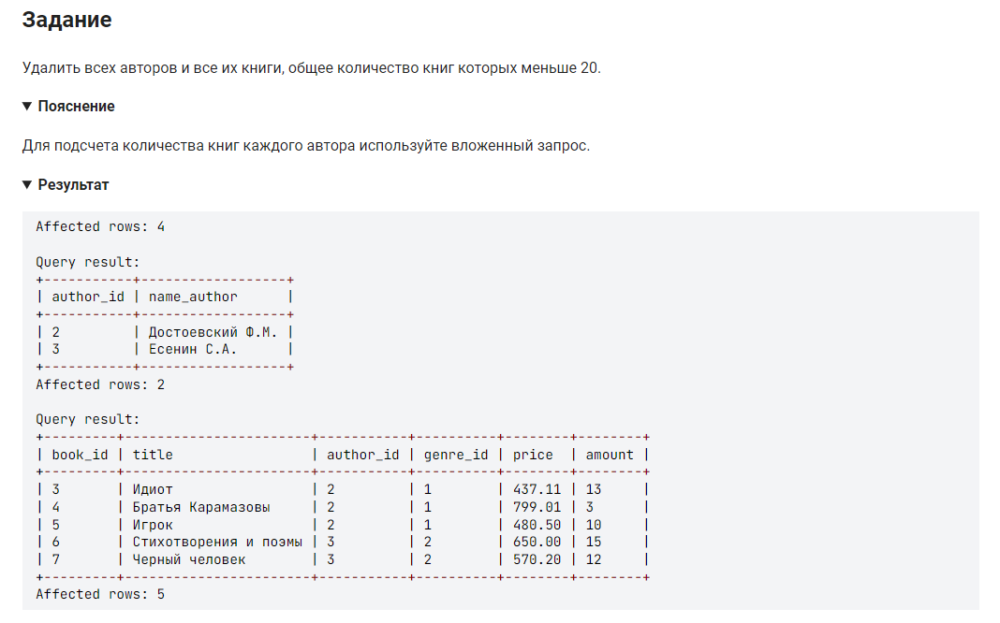

```sql 
DELETE FROM author              /* удалить из таблицы */
WHERE author_id IN              /* где номер автора в диапазоне */
	(SELECT author_id           /* выбрать данные из столбца */
    FROM book                   /* таблицы */
    GROUP BY author_id          /* сгруппировать по номеру автора */
    HAVING SUM(amount) < 20);   /* где сумма количества меньше 20 */
```


#### На [главную](https://github.com/BEPb/stepik_sql#readme)

---


