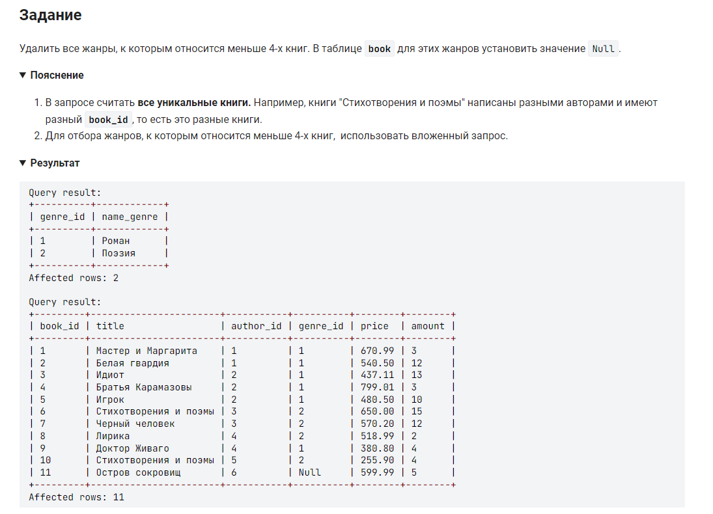

```sql 
DELETE FROM genre               /* удалить из таблицы */
WHERE genre_id IN               /* где столбец номер жанра в диапазоне */
	(SELECT genre_id            /* выбрать данные из столбца */
    FROM book                   /* таблицы */
    GROUP BY book.genre_id      /* сгруппировать по жанру */
    HAVING COUNT(title) < 4);   /* где количество названий меньше 4 */
```


#### На [главную](https://github.com/BEPb/stepik_sql#readme)

---


