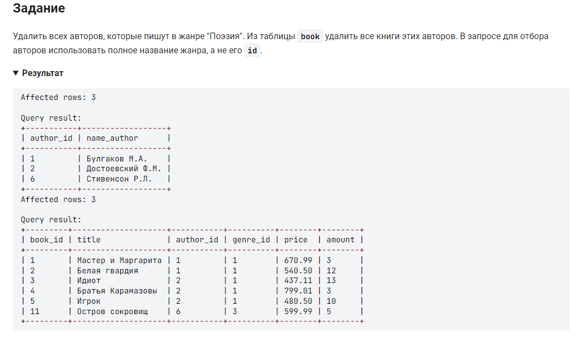

```sql 
DELETE FROM author USING author                             /* удалить из таблицы */
	INNER JOIN book ON book.author_id = author.author_id    /* используя таблицу объединенную с таблицей где номер автора равен */
    INNER JOIN genre ON genre.genre_id = book.genre_id      /* объединенную с таблицей где номер жанра равен */
WHERE name_genre = "Поэзия";                                /* где имя жанра = */
```
учитываю правильную структура таблиц и выкинув лишние слова, получим:
```sql
DELETE FROM author                      /* удалить из таблицы */
USING author JOIN book USING(author_id) /* используя таблицу объединенную с таблицей где номер автора равен */
             JOIN genre USING(genre_id) /* объединенную с таблицей где номер жанра равен */
WHERE name_genre='Поэзия'               /* где имя жанра = */
```


#### На [главную](https://github.com/BEPb/stepik_sql#readme)

---


