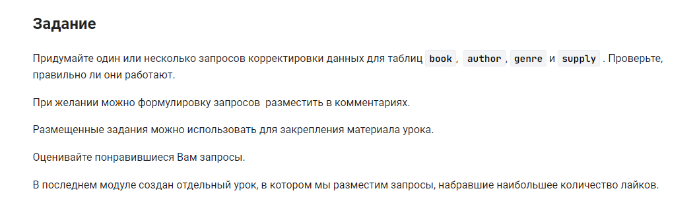

```sql 
/* немного порисуем */
CREATE TABLE flower(                            /* создадим таблицу цвето */
    line_id INT PRIMARY KEY AUTO_INCREMENT,     /* столбец - нумерация строк таблицы автоматическоя */
    line VARCHAR(50)                            /* столбец строка до 50 символов */
);

INSERT INTO flower(line)                        /* вставить значения таблица(столбец) */ 
VALUES                                          /* значения построчно: */
("         .     ."),
("    ...  :``..':"),
("     : ````.'   :''::'"),
("   ..:..  :     .'' :"),
("``.    `:    .'     :"),
("    :    :   :        :"),
("     :   :   :         :"),
("     :    :   :        :"),
("      :    :   :..''''``::."),
("       : ...:..'     .''"),
("       .'   .'  .::::'"),
("      :..'''``:::::::"),
("      '         `::::"),
("                  `::."),
("                   `::"),
("                    :::."),
("         ..:.:.::'`. ::'`.  . : : ."),
("       ..'      `:.: ::   :'       .:"),
("      .:        .:``:::  :       .: ::"),
("      .:    ..''     :::.'    :':    :"),
("       : .''         .:: : : '"),
("        :          .'`::"),
("                      ::"),
("                      ::"),
("                      ::"),
("                      ::"),
("                      ::"),
("                      ::");


SELECT line FROM flower;                    /* вывести все значения столбца */
```


#### На [главную](https://github.com/BEPb/stepik_sql#readme)

---


