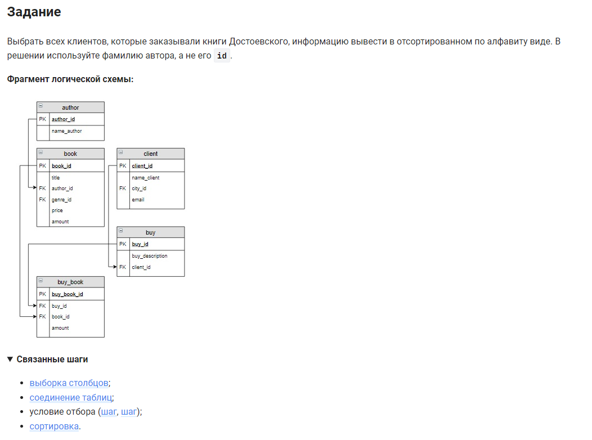

```sql 
SELECT DISTINCT name_client         /* выбрать уникальные значения столбца */
FROM author                         /* из таблицы */
    JOIN book ON (author.author_id=book.author_id) AND (author.name_author="Достоевский Ф.М.") /* объединить с таблицей при усвлоиях 1 и 2 */
    JOIN buy_book USING(book_id)    /* объединить с таблицей по столбцу */
    JOIN buy USING(buy_id)          /* объединить с таблицей по столбцу */
    JOIN client USING(client_id)    /* объединить с таблицей по столбцу */
ORDER BY name_client;               /* отсортировать по имени клиента */
```

еще вариант:
```sql
SELECT DISTINCT client.name_client          /* выбрать уникальные значения столбца */
FROM buy_book                               /* из таблицы */
    INNER JOIN book USING (book_id)         /* объединить с таблицей по столбцу */
    INNER JOIN author ON author.author_id = book.author_id AND author.name_author LIKE "Достоевский%"   /* объединить с таблицей при усвлоиях 1 и 2 */
    INNER JOIN buy USING (buy_id)           /* объединить с таблицей по столбцу */
    INNER JOIN client USING (client_id)     /* объединить с таблицей по столбцу */
ORDER BY client.name_client;                /* отсортировать по имени клиента */
```


#### На [главную](https://github.com/BEPb/stepik_sql#readme)

---


