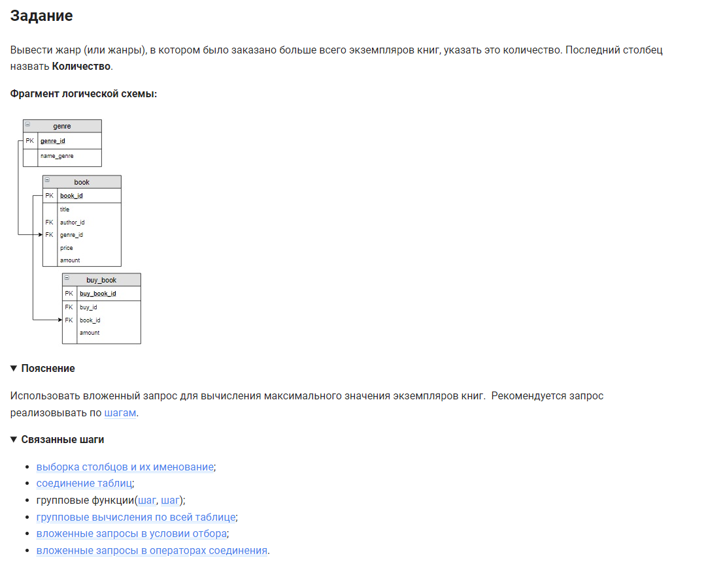

```sql 
SELECT                                      /* выбрать данные */
    ANY_VALUE(name_genre) AS name_genre,    /* столбец все значения жанра */
    MAX(Количество) AS Количество           /* столбец максимальное значение количества */
FROM                                        /* из встроенного запроса */
	(SELECT                                 /* выбрать данные */
	    name_genre,                         /* столбец */
	    SUM(buy_book.amount) AS Количество  /* столбец сумма покупок */
    FROM genre                              /* из таблицы */
		INNER JOIN book USING(genre_id)     /* объединение с таблицей по столбцу */
        INNER JOIN buy_book USING (book_id) /* объединение с таблицей по столбцу */ 
	GROUP BY name_genre)                    /* сгруппировать по жанру */
buff;                                       /* результат поместить в буфер */
```


#### На [главную](https://github.com/BEPb/stepik_sql#readme)

---


