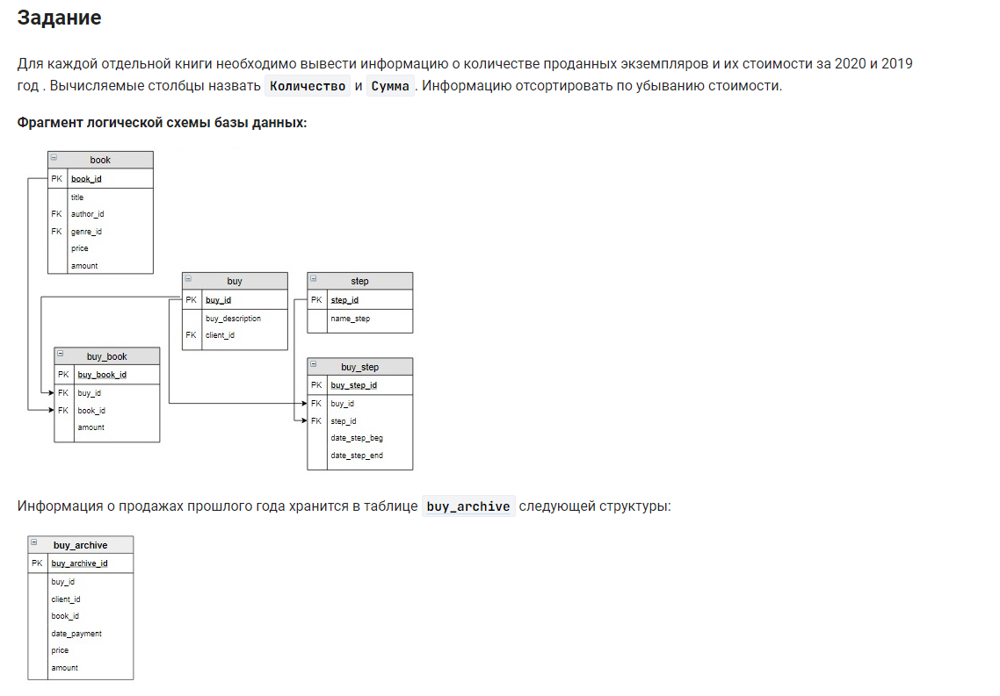

```sql 
SELECT                              /* выбрать данные */
    pivot_table.title,              /* столбец */
    SUM(Количество) Количество,     /* столбец суммы как количество */
    SUM(Сумма) Сумма                /* столбец суммы как сумма */
FROM                                /* из */
    (SELECT                         /* вложенные запрос - выбрать данные */
        ba.book_id,                 /* столбец */
        book.title title,           /* столбец */
        ba.amount Количество,       /* столбец */
        ba.price * ba.amount Сумма  /* столбец */
    FROM                            /* из */
        buy_archive ba              /* таблицы */
        JOIN book USING (book_id)   /* объединенной с таблицей по столбцу */
    WHERE                           /* где */
        ba.date_payment IS NOT NULL /* в столбец внесены значения */

    UNION ALL                       /* объединить все */

    SELECT                          /* выбрать данные */
        bb.book_id,                 /* столбец */
        book.title title,           /* столбец */
        bb.amount,                  /* столбец */
        book.price * bb.amount      /* столбец */
    FROM                            /* из */
        buy_book bb                 /* таблицы */
        JOIN book USING (book_id)   /* объединенной с таблицей по столбцу */
        JOIN buy USING (buy_id)     /* объединенной с таблицей по столбцу */
        JOIN buy_step bs USING (buy_id) /* объединенной с таблицей по столбцу */
        JOIN step USING (step_id)   /* объединенной с таблицей по столбцу */
    WHERE                           /* где */
        step.name_step = "Оплата" AND   /* условие 1 и */
        bs.date_step_end IS NOT NULL    /* условие 2 */
    ) AS pivot_table                    /* как псевдоним */

GROUP BY                            /* сгруппировать */
    pivot_table.book_id,            /* по номеру книги */
    pivot_table.title               /* по названию */
ORDER BY                            /* отсортировать */
    Сумма DESC;                     /* по убыванию суммы */

```


#### На [главную](https://github.com/BEPb/stepik_sql#readme)

---


