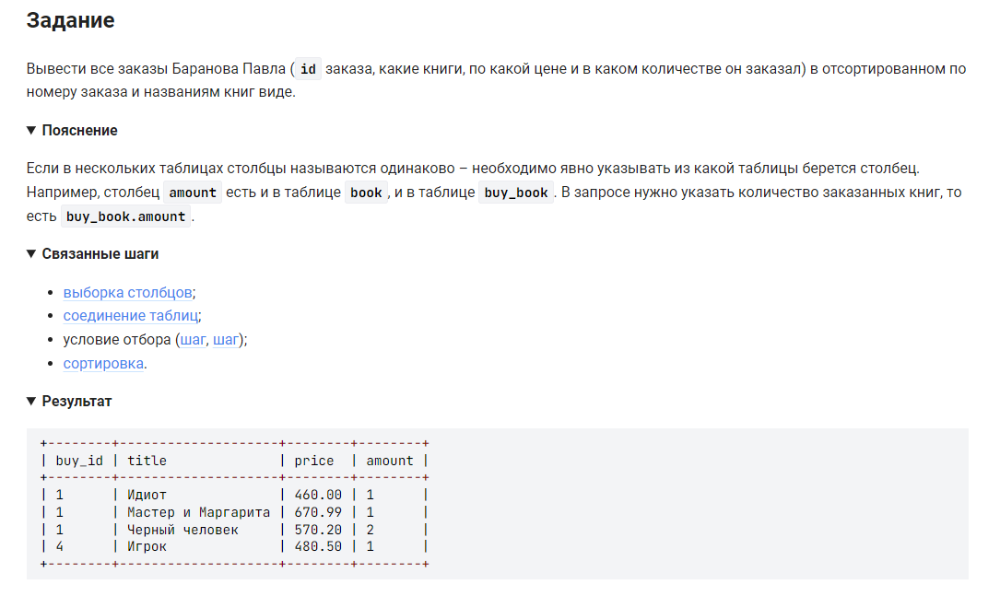

```sql 
SELECT buy.buy_id, book.title, book.price, buy_book.amount  /* выбрать данные */
FROM client                                                 /* из таблицы */
	INNER JOIN buy ON client.client_id = buy.client_id      /* объединить с таблицей где номер клиента совпадают */
    INNER JOIN buy_book ON buy.buy_id = buy_book.buy_id     /* объединить с таблицей где номер книги совпадают */
    INNER JOIN book ON buy_book.book_id = book.book_id      /* объединить с таблицей где номер книги совпадают */
WHERE client.name_client = "Баранов Павел"                  /* где имя клиента = */
ORDER BY buy.buy_id, book.title;                            /* отсортировать по номеру заказа и названиям книг */
```


#### На [главную](https://github.com/BEPb/stepik_sql#readme)

---


