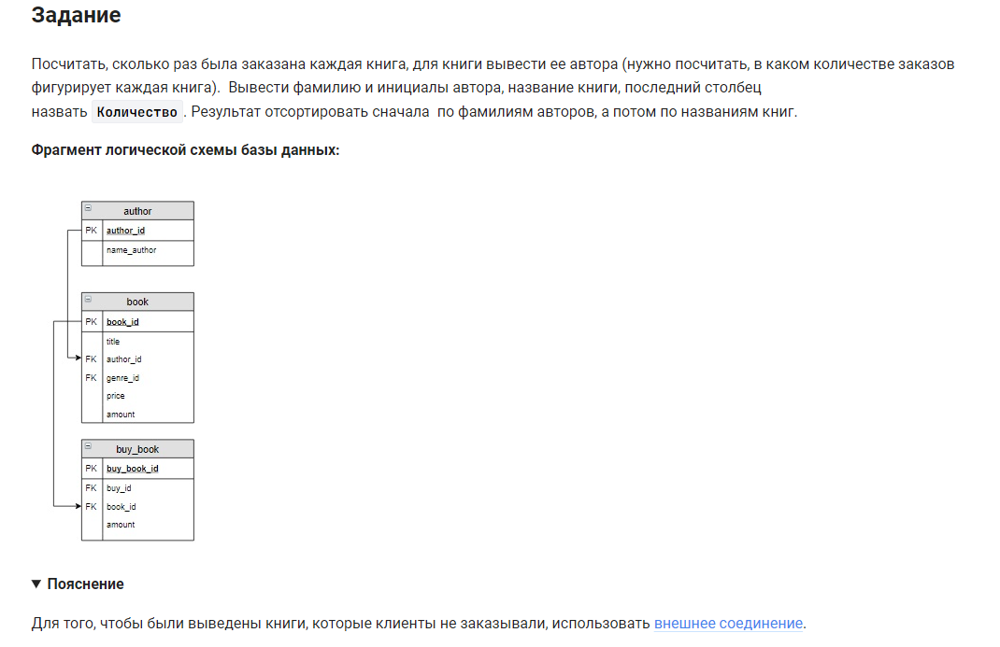

```sql 
SELECT                                      /* выбрать данные */
    author.name_author,                     /* таблица.столбец */
    book.title,                             /* таблица.столбец */
    COUNT(buy_book.book_id) AS Количество   /* количество (книг) как псевдоним */
FROM                                        /* из */
    book                                    /* таблицы */
    LEFT JOIN buy_book USING (book_id)      /* левое объединение с таблицей */
    INNER JOIN author USING (author_id)     /* объединение с таблицей */
GROUP BY                                    /* сгруппировать */
    book.book_id                            /* по таблица.столбец */
ORDER BY                                    /* отсортировать */
    author.name_author,                     /* по имени автора */
    book.title;                             /* затем по названию книг */
```


#### На [главную](https://github.com/BEPb/stepik_sql#readme)

---


