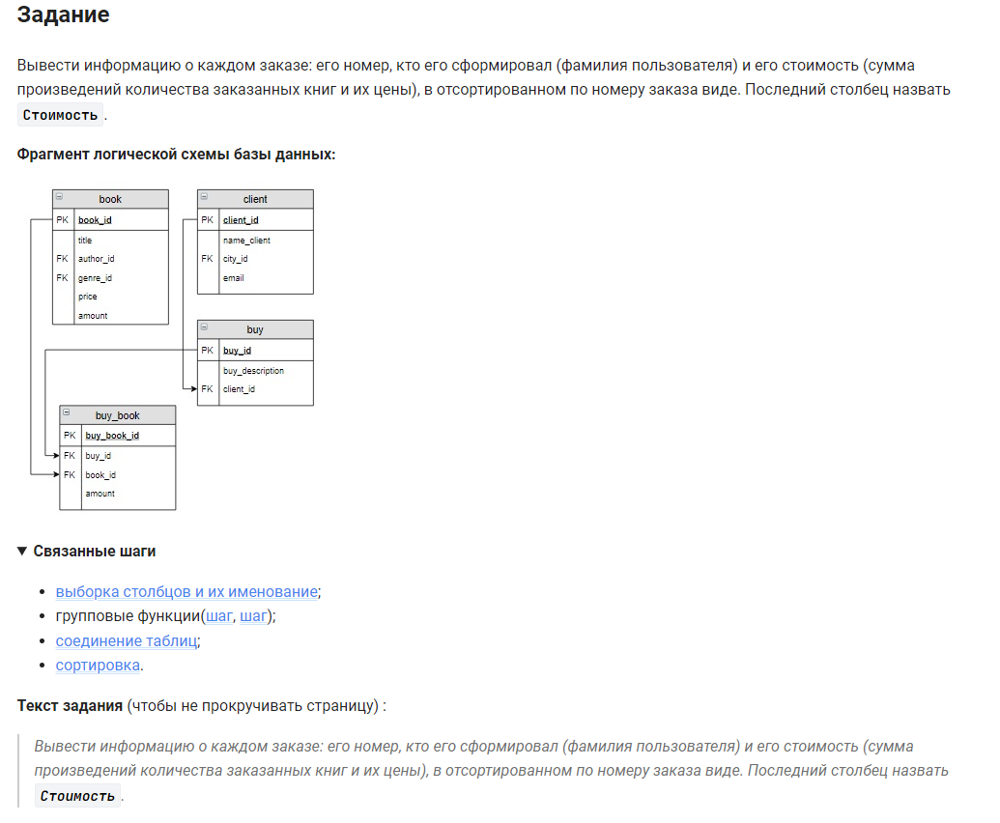

```sql 
SELECT                                              /* выбрать данные */
    buy_book.buy_id,                                /* таблица.столбец */
    name_client,                                    /* столбец */
    SUM(buy_book.amount * book.price) AS Стоимость  /* столбец вычисления суммы */
FROM client                                         /* из таблицы */
	INNER JOIN buy USING (client_id)                /* объединить с таблицей по столбцу */
    INNER JOIN buy_book USING(buy_id)               /* объединить с таблицей по столбцу */
    INNER JOIN book USING(book_id)                  /* объединить с таблицей по столбцу */
GROUP BY buy_book.buy_id                            /* сгруппировать */
ORDER BY buy_book.buy_id;                           /* вывести отсортировав по столбцу */
```


#### На [главную](https://github.com/BEPb/stepik_sql#readme)

---


