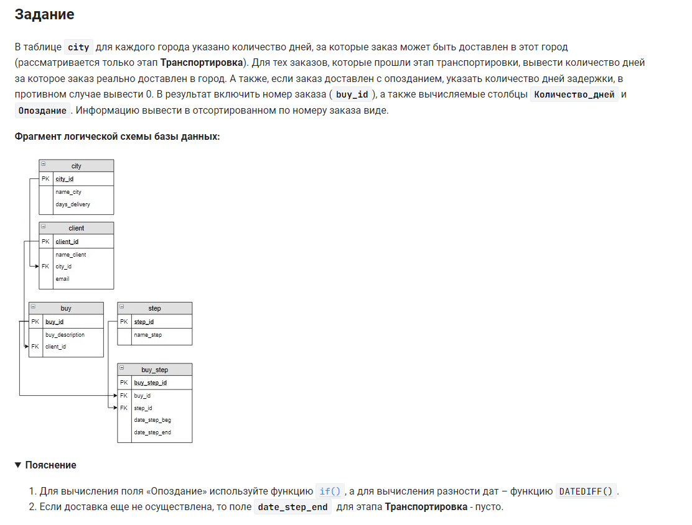

```sql
SELECT                                                              /* выбрать данные */
    buy_id,                                                         /* столбец */
    DATEDIFF(date_step_end, date_step_beg) AS Количество_дней,      /* вычислить и назвать столбец */
    GREATEST(DATEDIFF(date_step_end, date_step_beg) - days_delivery, 0) AS Опоздание    /* вычислить и назвать столбец */
FROM buy                                                            /* из таблицы */
    INNER JOIN buy_step USING(buy_id)                               /* объединить с таблицей */
    INNER JOIN step     USING(step_id)                              /* объединить с таблицей */
    INNER JOIN client   USING(client_id)                            /* объединить с таблицей */
    INNER JOIN city     USING(city_id)                              /* объединить с таблицей */
WHERE                                                               /* где */
    name_step = 'Транспортировка' AND                               /* условие 1 и*/
    date_step_end IS NOT NULL                                       /* условие 2 */
ORDER BY buy_id;                                                    /* отсортировать по номеру заказа */
```

еще вариант, подумайте почему такое написание:
```sql 
SELECT                                                                              /* выбрать данные */
    DISTINCT buy_book.buy_id,                                                       /* уникальные значения столбца */
    DATEDIFF(date_step_end, date_step_beg) AS Количество_дней,                      /* столбец количество дней */
    IF                                                                              /* если */
        (DATEDIFF(date_step_end, date_step_beg) > city.days_delivery,               /* условие 1 и */
        DATEDIFF(date_step_end, date_step_beg) - city.days_delivery, 0) AS Опоздание    /* условие 2 столбец как опоздание */
FROM city                                                                           /* из таблицы */
	INNER JOIN client USING (city_id)                                               /* объединить с таблицей */
    INNER JOIN buy USING (client_id)                                                /* объединить с таблицей */
    INNER JOIN buy_book USING (buy_id)                                              /* объединить с таблицей */
    INNER JOIN buy_step USING (buy_id)                                              /* объединить с таблицей */
    INNER JOIN step USING (step_id)                                                 /* объединить с таблицей */
WHERE                                                                               /* где */
    buy_step.step_id = 3 AND                                                        /* условие 1 и */
    DATEDIFF(date_step_end, date_step_beg) IS NOT NULL;                             /* условие 2 */
```


#### На [главную](https://github.com/BEPb/stepik_sql#readme)

---


