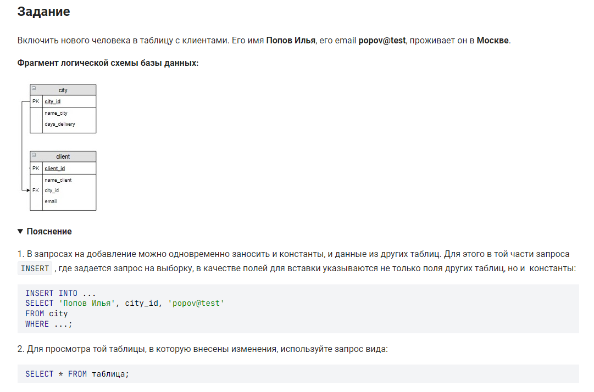

```sql 
INSERT INTO client                          /* вставить данные в таблицу */
    (name_client,                           /* столбец */
    city_id,                                /* столбец */
    email)                                  /* столбец */
VALUES                                      /* значения */
    ('Попов Илья',                          /* значение в столбец имя клиента */
    (SELECT city_id                         /* значение в столбец номер города */
        FROM city                           /* берем из таблицы городов */
        WHERE name_city = 'Москва'),        /* где название города = */
    'popov@test');                          /* значение в столбец почта */
```

или: 
```sql
INSERT INTO  client         /* вставить в таблицу */
    (client.name_client,    /* столбец */
    client.city_id,         /* столбец */
    client.email)           /* столбец */
SELECT                      /* выбрать данные */
    'Попов Илья',           /* значение */
    city_id,                /* значение */
    'popov@test'            /* значение */
FROM                        /* из */
    city                    /* таблицы */
WHERE                       /* где */
    city.name_city = 'Москва';  /* условие */
```


#### На [главную](https://github.com/BEPb/stepik_sql#readme)

---


