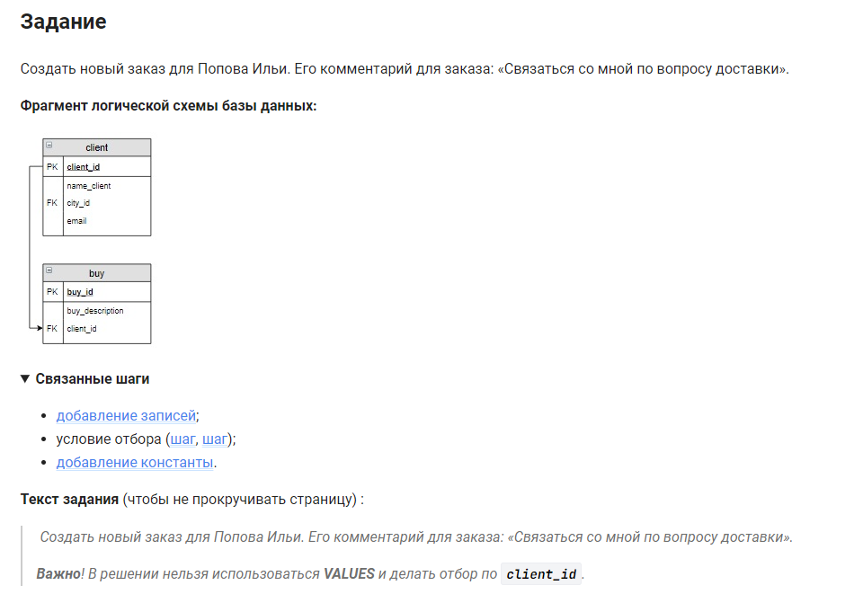

```sql 
INSERT INTO                                 /* вставить данные */
    buy (buy.buy_description, client_id)    /* в таблицу (столбцы) */
SELECT                                      /* выбрать данные */
    "Связаться со мной по вопросу доставки" /* коментарий в первый столбец */
    , client_id                             /* значение во второй столбец */
FROM                                        /* из */
    client                                  /* таблицы */
WHERE                                       /* где */
    client.name_client = "Попов Илья";      /* имя клиента */
```


#### На [главную](https://github.com/BEPb/stepik_sql#readme)

---


