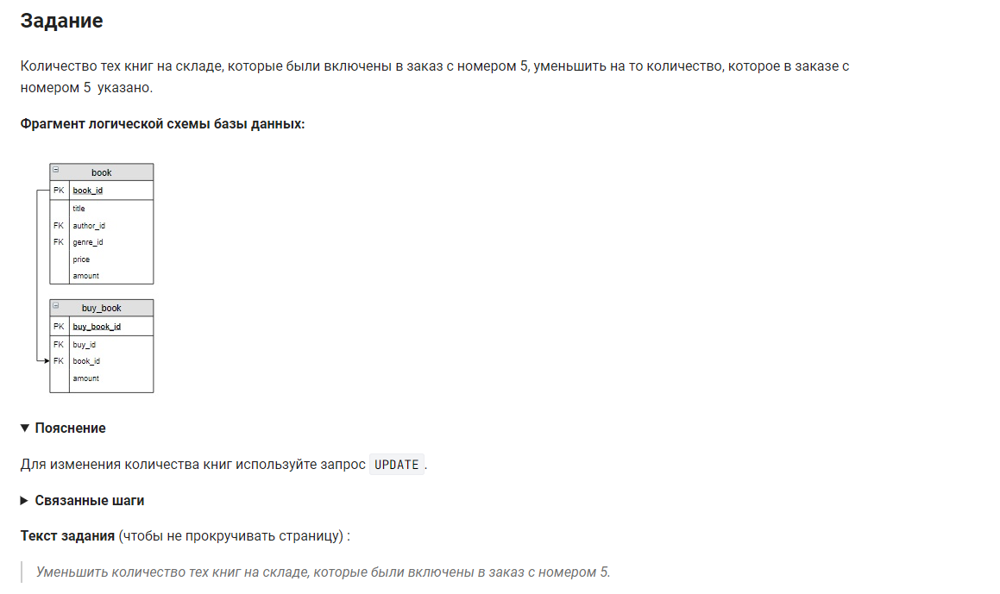

```sql 
UPDATE                                              /* обновить */
    book                                            /* таблицу */
    JOIN buy_book                                   /* объединенную с таблицей */
    ON buy_book.book_id = book.book_id              /* по столбцу */
SET                                                 /* заменить */
    book.amount = book.amount - buy_book.amount     /* количество по формуле */
WHERE                                               /* где */
    buy_book.buy_id = 5;                            /* номер заказа = 5 */
```
упростим немного запрос:
```sql
UPDATE                                              /* обновить */
    book                                            /* таблицу */
    JOIN buy_book USING(book_id)                    /* объединенную с таблицей */
SET                                                 /* заменить */
    book.amount = book.amount - buy_book.amount     /* количество по формуле */
WHERE                                               /* где */
    buy_book.buy_id = 5;                            /* номер заказа = 5 */
```
немного иначе:
```sql
UPDATE                                              /* обновить */
    book, buy_book                                  /* объединенную с таблицей */
SET                                                 /* заменить */
    book.amount = book.amount - buy_book.amount     /* количество по формуле */
WHERE                                               /* где */
    buy_book.buy_id = 5 AND                         /* условие 1 */
    buy_book.book_id = book.book_id                 /* условие 2 */
```
#### На [главную](https://github.com/BEPb/stepik_sql#readme)

---


